<div align="center">


# INTERCEPTOR

**A complete network supervision station for Firefox.**
Every request the browser makes — captured without duplicates, explained in plain language, and modifiable on demand.

Created by **D4RK**

[](https://github.com/isneoz1/interceptor/actions/workflows/tests.yml)


[](LICENSE)


[**Install**](#3-installation) · [**Screenshots**](#2-screenshots) · [**How it works**](#4-how-it-works-the-capture-layers) · [**Changelog**](CHANGELOG.md) · [**Security**](SECURITY.md)

</div>

> Firefox's own network panel shows you *that* a request happened.
> INTERCEPTOR shows you **everything about it** — the response body pulled off the wire, the
> JavaScript stack that triggered it, the TLS suite that carried it, the exact reason a
> cookie will be rejected — and lets you block it, rewrite it, or send it again.
>
> Seven capture layers, zero duplicated rows, no telemetry, no dependencies, and an analyser
> that refuses to report anything it cannot prove.

---

## Table of contents

1. [What it is](#1-what-it-is)
2. [Screenshots](#2-screenshots)
3. [Installation](#3-installation)
4. [How it works: the capture layers](#4-how-it-works-the-capture-layers)
5. [One request = one row: the correlator](#5-one-request--one-row-the-correlator)
6. [Surfaces: popup, sidebar, console](#6-surfaces-popup-sidebar-console)
7. [The views, one by one](#7-the-views-one-by-one)
8. [The detail panel: twelve tabs](#8-the-detail-panel-twelve-tabs)
9. [Search: full syntax](#9-search-full-syntax)
10. [The security analyser](#10-the-security-analyser)
11. [The toolbox: 23 families](#11-the-toolbox-23-families)
12. [Acting on traffic: rules and interception](#12-acting-on-traffic-rules-and-interception)
13. [Replaying a request](#13-replaying-a-request)
14. [Import and export](#14-import-and-export)
15. [Settings](#15-settings)
16. [Keyboard shortcuts](#16-keyboard-shortcuts)
17. [Privacy: what leaves the machine](#17-privacy-what-leaves-the-machine)
18. [Code architecture](#18-code-architecture)
19. [Why the source is in French](#19-why-the-source-is-in-french)
20. [Tests](#20-tests)
21. [Building the package](#21-building-the-package)
22. [Contributing](#22-contributing)
23. [Licence](#23-licence)

---

## 1. What it is

INTERCEPTOR is a Firefox extension that observes **everything** the browser sends and
receives, then gives you the means to understand it and act on it.

The browser's built-in network tools show you requests. INTERCEPTOR goes further on four
specific points:

| | What INTERCEPTOR does |
|---|---|
| **It misses nothing** | Seven capture layers run in parallel: `webRequest`, response bodies via `StreamFilter`, page probes (`fetch`, `XHR`, WebSocket, SSE, Beacon, WebRTC), `PerformanceObserver`, TLS, cookies, navigation. What one layer misses, another sees. |
| **It never counts twice** | A correlator pairs observations coming from different layers. One real request produces **one** row, even when five layers saw it. Two identical polling `GET`s stay two separate rows. |
| **It explains** | 62 status codes, 129 headers, 70 media types, 83 ports, 31 TLS cipher suites, TLS alerts, QUIC and HTTP/3 errors, DNS record types — all described in the tool, offline. |
| **It never guesses** | The security analyser only reports what is **provable** from what was captured. Every finding carries its evidence. A missing hardening header is not a vulnerability, so it is not reported. |

**What it is not**: not a proxy, not a vulnerability scanner, not an attack tool. Everything
happens inside your Firefox, on your machine.

**By the numbers**: 144 JavaScript modules, ~28,000 lines, zero external dependencies,
822 automated assertions, English and French interface.

---

## 2. Screenshots

> Every image below is a screenshot of the real tool. They are produced by
> `node tools/captures.mjs`, which renders the actual console in a headless Chromium fed by
> traffic that was run through the **real kernel** — same store, same analyser, same
> statistics as in Firefox. These are not mockups.

### The request table

All traffic, one row per request. Configurable columns, sorting, quick facets, virtualised
scrolling (the table stays fluid at tens of thousands of rows).

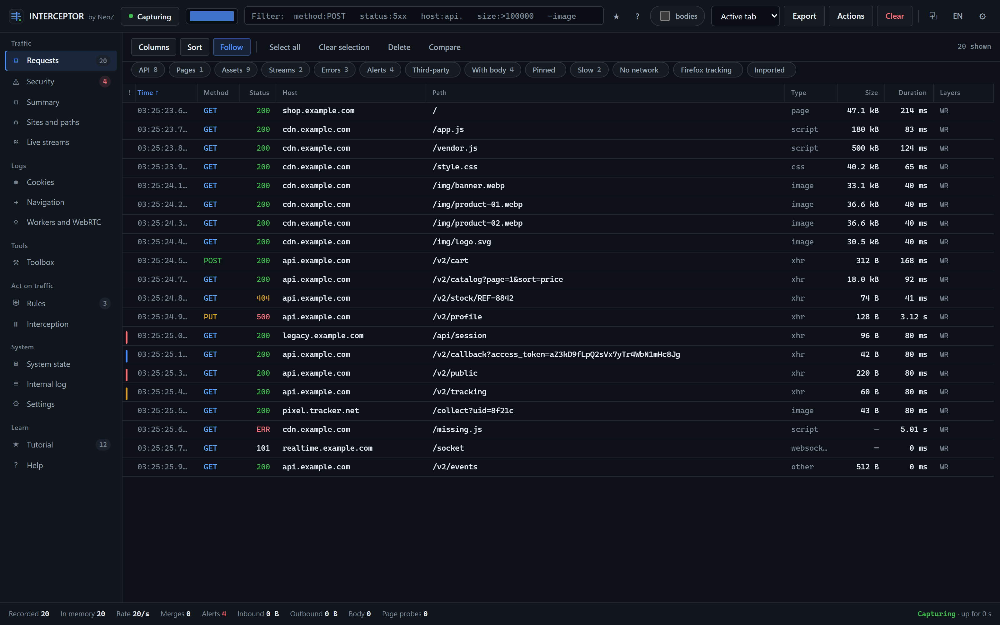

### The Security view

What the analyser was able to **prove**, ranked by severity, each finding carrying its
evidence and a link back to the originating request.

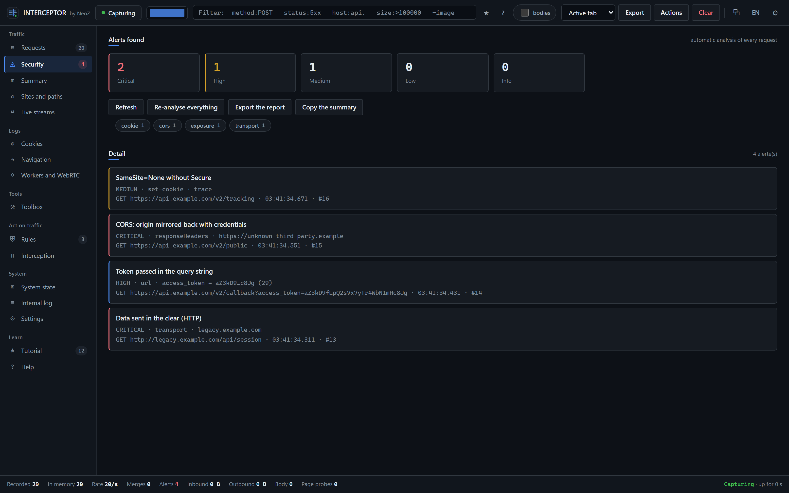

### A request in detail

Twelve tabs covering the whole record, including a "Raw" tab that prints the complete
object: no captured data can escape display.

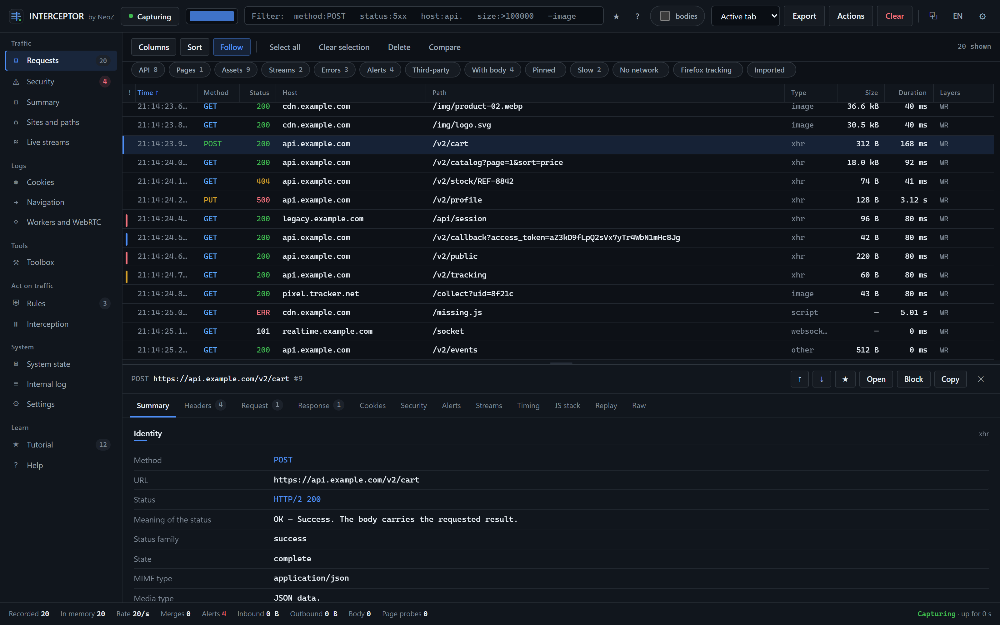

### Headers, read and interpreted

Every header is explained. The **CSP policy** is broken down directive by directive, with a
plain-language statement of what it actually allows. **Cache freshness** is recomputed from
the RFC 9111 formulas, using the headers actually received and the timestamps actually
measured.

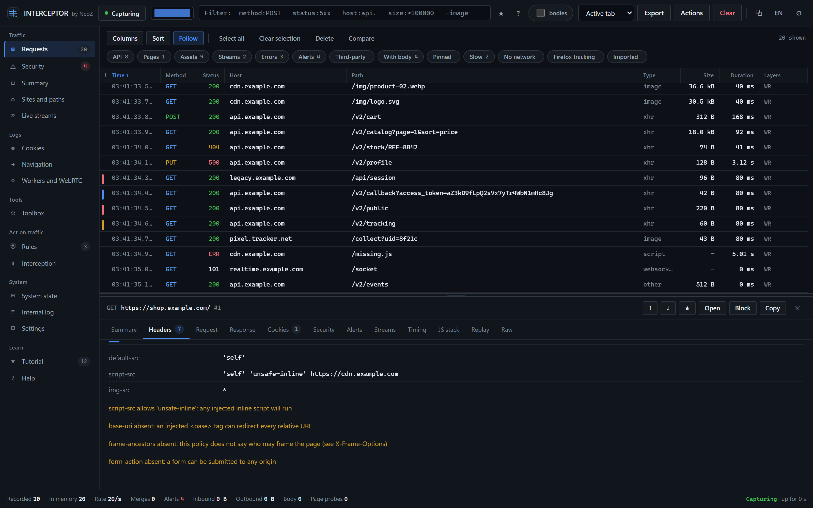

### The numeric summary

The figures for the observed scope: statuses, resource types, domains by volume and by
count, real protocols, active capture layers.

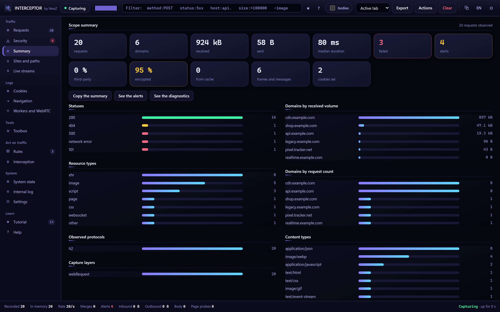

### Sites and paths

What exists on the visited sites, host by host, reconstructed from observed traffic.

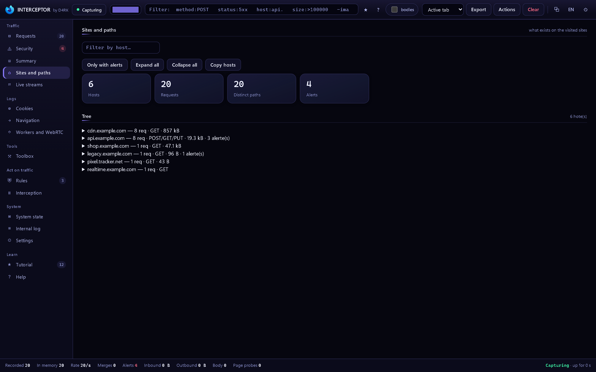

### The toolbox

134 transformations across 23 families: decode, hash, measure, inspect — everything is
computed locally, nothing leaves the machine.

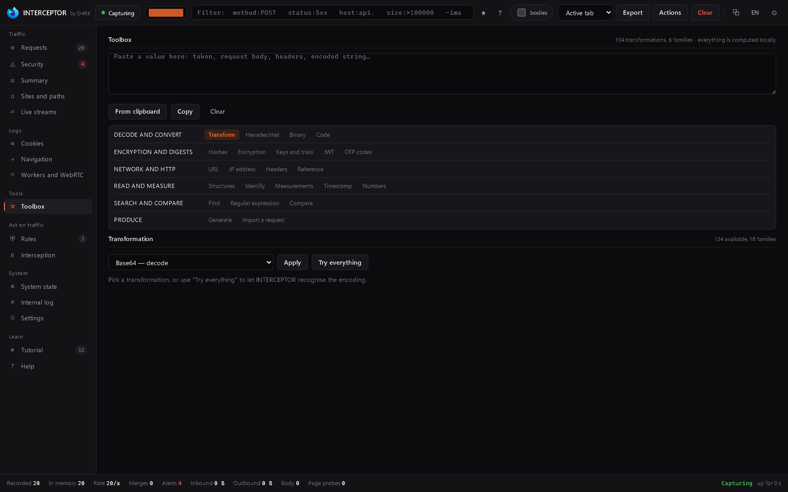

### Rules

Block, redirect, force HTTPS, rewrite headers, mock a response, inject latency, replace a
pattern inside a body.

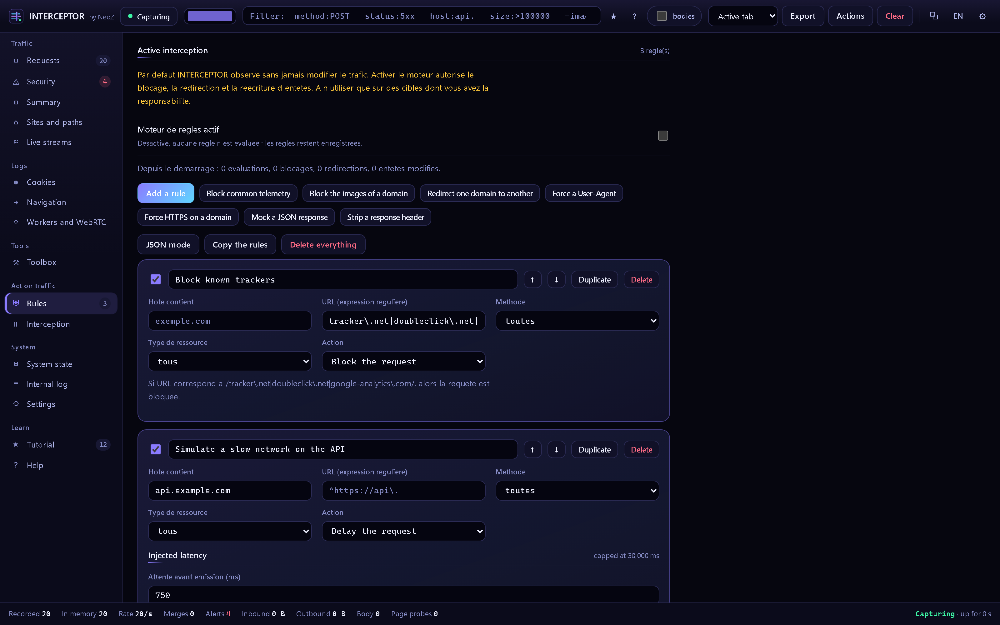

### System state

What each layer is actually capturing, and the kernel's own counters.

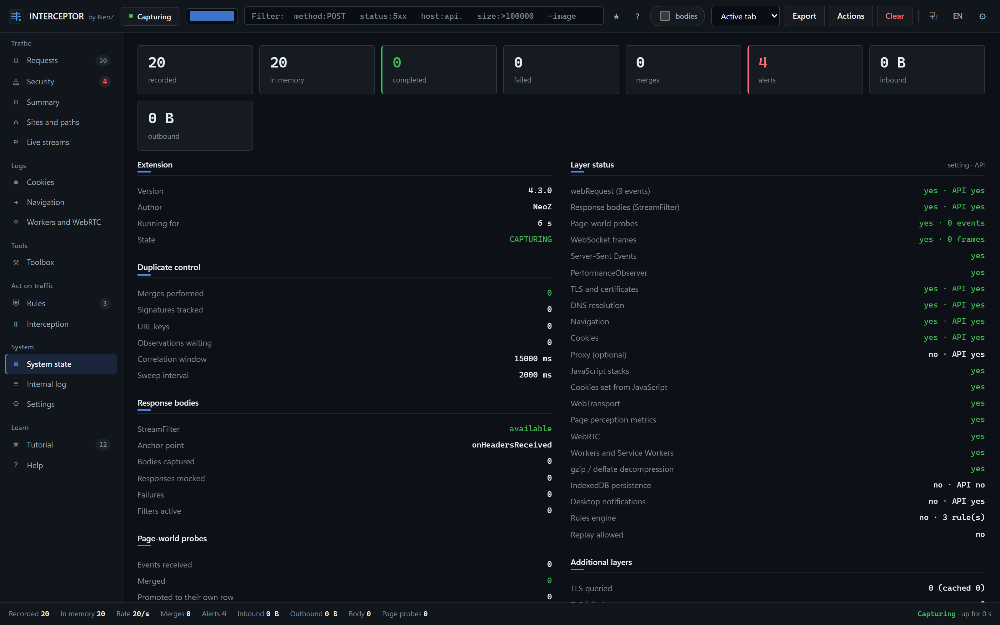

### Settings

Every option, plus four ready-made profiles.

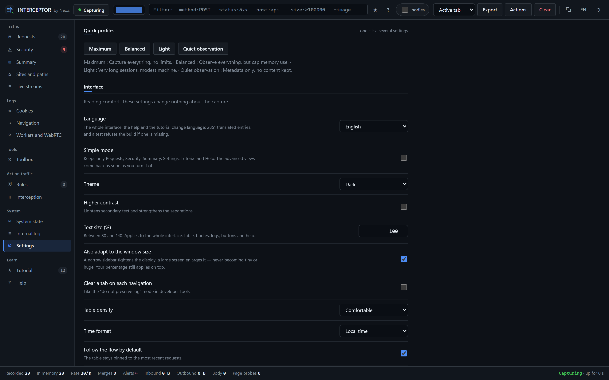

### Built-in help

The complete manual, offline, inside the extension.

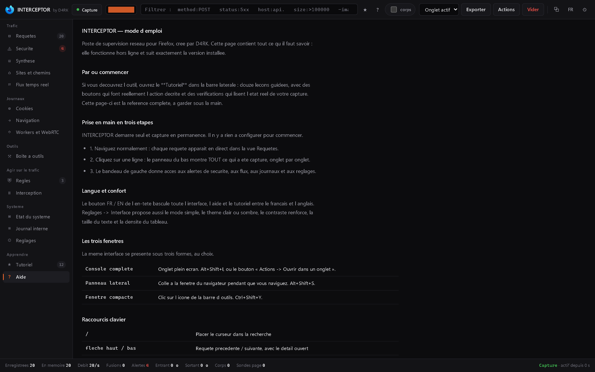

---

## 3. Installation

### A. Temporary load (simplest way to try it)

1. Open `about:debugging#/runtime/this-firefox` in Firefox.
2. Click **Load Temporary Add-on…**.
3. Pick the `manifest.json` file at the root of the repository.

Capture starts immediately, with nothing to configure. The extension disappears when
Firefox restarts — that is how temporary loading works.

### B. `.xpi` package

Download it from the [latest release](https://github.com/isneoz1/interceptor/releases/latest),
or build it yourself:

```powershell
.\build.ps1
```

The package is written to `dist/interceptor-<version>.xpi`. Firefox only installs an
**unsigned** `.xpi` on **Developer Edition**, **Nightly** or **ESR**, and only after setting
`xpinstall.signatures.required` to `false` in `about:config`. On a standard Firefox, use the
temporary load above.

### C. First run

Nothing to configure. On first start the console opens on the help page. After that:

- **Ctrl+Shift+Y** — the compact window
- **Alt+Shift+S** — the sidebar panel
- **Alt+Shift+I** — the full console in a tab
- **Ctrl+Shift+U** — pause / resume capture, even outside the console

### Permissions requested, and why

| Permission | What it is for |
|---|---|
| `<all_urls>`, `webRequest`, `webRequestBlocking` | Seeing requests and, if you enable it, modifying them |
| `webNavigation` | Knowing which page originated which request |
| `cookies` | Logging every cookie set, changed or removed |
| `dns` | Resolving names to show the address actually contacted |
| `storage`, `unlimitedStorage` | Keeping your settings, and the session if you enable persistence |
| `downloads` | Writing export files to disk |
| `clipboardWrite` | The "Copy" buttons |
| `contextMenus` | The context-menu entries |
| `proxy`, `notifications` | **Optional**: requested only if you turn those features on |

---

## 4. How it works: the capture layers

The kernel (`background/`) starts seven layers in the order of a request's life cycle. Each
one sees something the others cannot.

```
   ┌─ proxy ─────────── earliest hook (optional, passive)
   │
   ├─ webRequest ────── 9 events: onBeforeRequest → onCompleted / onErrorOccurred
   │   ├─ StreamFilter ─ the response body, as it arrives on the wire
   │   ├─ securityInfo ─ certificate, TLS version, cipher suite
   │   └─ dns.resolve ── canonical name and resolved addresses
   │
   ├─ navigation ────── page context: which document, which frame
   │
   ├─ cookies ───────── cookie mutations, including those made from JavaScript
   │
   └─ page probes ───── injected into the page (content/hooks.js):
       fetch, XMLHttpRequest, WebSocket, EventSource (SSE), sendBeacon,
       WebRTC, Service Workers, PerformanceObserver, JS call stacks
```

**Why several layers?** Because none of them is enough on its own:

- `webRequest` does not give you the response body → `StreamFilter` does.
- `webRequest` never sees a request served from cache or by a Service Worker →
  `PerformanceObserver` does.
- `webRequest` cannot tell you *which line of JavaScript* triggered the call → the page
  probe captures the stack.
- Individual WebSocket frames never pass through `webRequest` → the probe reads them.

Each layer can be enabled and disabled independently in the settings, and the **System
state** view shows live what each one is actually capturing.

---

## 5. One request = one row: the correlator

This is the heart of the project, and the hardest problem in it. Seven layers observe the
same request; the result must be a single row.

The correlator (`background/core/dedup.js`) enforces three strict rules:

1. **Two observations from the same layer never merge.**
   Two identical `GET`s issued by a polling loop stay two distinct rows. That is what you
   want to see.

2. **A secondary observation joins a record at most once.**
   Strict 1:1 pairing, FIFO. `webRequest` is the authoritative layer; the others attach to
   it, each exactly once.

3. **An orphan observation becomes its own row.**
   If no parent is found within the correlation window, the observation is promoted to a
   standalone row. **Nothing is ever lost** — a Service Worker request, which appears in no
   `webRequest` event at all, stays visible.

The pairing signature is `METHOD + normalised URL + tab/frame`. URL normalisation
(lowercasing, default port removed, `.` and `..` segments resolved) means
`HTTPS://A.FR:443/x/../y` and `https://a.fr/y` produce the same key.

The **Merges** counter in the status bar shows how many observations were paired. The
**System state** view breaks down layers, promoted orphans and pending queues.

---

## 6. Surfaces: popup, sidebar, console

The **same page** serves as popup, sidebar panel, full-screen tab and options page. The
layout adapts to the available width, and the typographic scale is recomputed so it stays
readable from a 340 px sidebar to a 4,000 px display.

| Surface | How to open | What for |
|---|---|---|
| **Popup** | Click the toolbar icon | A quick glance: counters, pause, jump to the console |
| **Sidebar panel** | `Alt+Shift+S` | Watching while you browse — the page stays visible |
| **Full console** | `Alt+Shift+I` | The complete workstation |
| **Options page** | Add-ons manager | The same console |

What clicking the icon does is configurable in the settings (popup, tab, sidebar or
detached window).

<div align="center">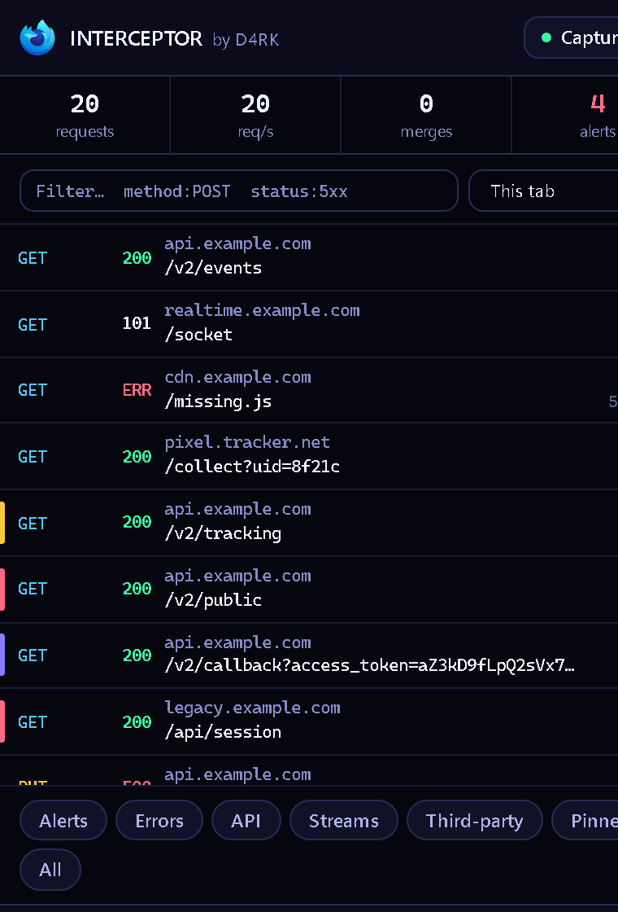</div>

---

## 7. The views, one by one

The sidebar groups 17 views into five families. **Simple mode** (in settings) hides the
advanced views and keeps only the essentials.

### Traffic

| View | What it shows |
|---|---|
| **Requests** | All traffic, request by request. The table is virtualised with an exact-height invariant, so `scrollHeight` never shifts while you scroll and the wheel stays smooth at any zoom level. Configurable columns, sorting on any column, quick facets (API, pages, resources, streams, errors, alerts, third-party, slow…), multiple selection, per-row context menu, free-text annotation and colour marking. The table is virtualised: only visible rows are drawn. |
| **Security** | The analyser's findings, grouped by severity, each with its evidence and a link to the request. Rendered in batches as you scroll, so nothing is capped and nothing freezes. The report can be exported as Markdown. |
| **Summary** | The overall figures: requests, domains, volumes received and sent, median duration, errors, third-party share, encrypted share, cache, frames, cookies. Then the breakdowns: statuses, resource types, domains by volume and by count, real protocols, content types, capture layers. |
| **Sites and paths** | The tree of what exists on each visited host, reconstructed from traffic. Useful to see an application's real surface. |
| **Live streams** | WebSocket and Server-Sent Events, message by message, with direction (in/out), timestamp and payload. |
| **Comparison** | Two requests side by side, line by line: headers, bodies, timings. Select two rows and press `C`. |

### Logs

| View | What it shows |
|---|---|
| **Cookies** | Every cookie set, changed or removed, with the cause and all its attributes. Like the other logs, rendered in batches: no entry is hidden behind a display cap. |
| **Navigation** | Page and frame changes: start, commit, DOM ready, completion, errors, history changes. |
| **Workers and WebRTC** | Workers, Service Workers, WebRTC connections and page performance metrics. |

### Tools

| View | What it shows |
|---|---|
| **Toolbox** | See [section 11](#11-the-toolbox-23-families). |

### Acting on traffic

| View | What it shows |
|---|---|
| **Rules** | Automatic interception rules. See [section 12](#12-acting-on-traffic-rules-and-interception). |
| **Interception** | The queue of suspended requests, to edit then release one by one. |

### System

| View | What it shows |
|---|---|
| **System state** | What each layer is actually capturing, the browser capabilities detected, and the counters of the store, the correlator and the analyser. This is the view to check when something seems to be missing. |
| **Internal log** | INTERCEPTOR's own errors, and the log of its own commands. Exportable for a bug report. |
| **Settings** | See [section 15](#15-settings). |

### Learning

| View | What it shows |
|---|---|
| **Tutorial** | Twelve lessons to get to grips with the tool. A lesson is only ticked once you have actually performed the action — never on your behalf. |
| **Help** | The complete manual, offline. |

---

## 8. The detail panel: twelve tabs

Click a row and the panel opens at the bottom, resizable. The ↑ ↓ arrows move to the
previous or next request **in displayed order**, filters included.

| Tab | Contents |
|---|---|
| **Summary** | Identity (method, URL, status with its meaning, media type), network (IP, real protocol, cache, on-the-wire sizes, performance metrics), context (tab, window, frame, document, origin, third-party, Firefox tracking classification), and the free-text annotation. |
| **Headers** | URL parameters, request headers, response headers, headers as seen by page JavaScript. Every known header is explained on hover. Then two computed analyses: **HTTP freshness** (RFC 9111: freshness lifetime, current age broken down, time remaining, validators, `Vary`, directives) and the **CSP policy** (each directive with its meaning, then a plain statement of what the policy allows). |
| **Request** | The body sent: nature, source, declared type, encoding, compression. Automatic JSON formatting, form fields broken out, and **`multipart/form-data` bodies decoded part by part** (field name, filename, type, content). |
| **Response** | The body received, with the same treatment, plus image preview and hex rendering for binary. |
| **Cookies** | Cookies set and changed by this request, with all attributes detailed. |
| **Security** | Certificate, chain, TLS version, cipher suite, forward secrecy, certificate transparency. |
| **Alerts** | The analyser's findings for this request, each with its evidence. |
| **Streams** | The WebSocket frames or SSE messages of this connection. |
| **Timeline** | Every step, timestamped, from first observation to last. |
| **JS stack** | The JavaScript call stack that triggered the request, when the page probe was able to capture it. |
| **Replay** | See [section 13](#13-replaying-a-request). |
| **Raw** | The complete object as it exists in memory. This is the safety net: **no captured data can stay invisible**. An automated test (`tests/detail-coverage.test.mjs`) verifies that each of a record's 60 fields is displayed somewhere. |

---

## 9. Search: full syntax

The search box accepts free text, regular expressions between `/`, and per-field filters.
Terms combine with **AND**. A leading `-` **excludes**.

```
method:POST status:5xx host:api. size:>100000 -image /regex/
```

### Text fields

`method:` `type:` `host:` `path:` `url:` `mime:` `scheme:` `proto:` `ip:` `tag:` `risk:`
`src:` `state:` `init:` `tls:` `error:` `classe:` `note:` `color:`

### Numeric fields

Accept `>`, `<`, `>=`, `<=`, `=` and ranges.

`status:` (also accepts `2xx` through `5xx`) `size:` `duration:` `tab:` `frame:` `id:`
`findings:` `redirects:` `ws:` `sse:` `cookies:` `wire:`

### Boolean fields

`flag:` (pinned) `third:` (third-party) `cache:` (served from cache) `body:` (body captured)
`stack:` (JS stack present) `private:` (private browsing) `replayed:` (replayed)
`imported:` (came from an imported HAR)

### Examples

| Query | What it finds |
|---|---|
| `status:5xx` | Every server error |
| `host:api. method:POST` | POSTs to a host containing "api." |
| `size:>1000000` | Everything over one megabyte |
| `duration:>3000 -image` | Slow requests, images excluded |
| `risk:critical` | Requests carrying a critical finding |
| `third:true cookies:>0` | Third parties that set cookies |
| `/\/api\/v[0-9]+\//` | Versioned API paths, by regular expression |
| `tag:cleartext` | Everything travelling in the clear |

The **bodies** checkbox extends the search to bodies, headers, frames and stacks.
The ★ button saves the current filter and recalls recent searches.
The `?` button next to the field opens the full syntax help.

---

## 10. The security analyser

One governing rule: **a finding is only reported if it is provable from what was captured,
and if it corresponds to a genuinely exploitable weakness.** Every finding carries its
evidence, in plain language.

### What is reported

| Rule | Severity | Evidence |
|---|---|---|
| Credentials written in the URL | critical | The URL contains `user:password@` — the password is in history, in logs and in the `Referer` |
| Token passed in the query string | high | An unambiguously named parameter (`access_token`, `api_key`…) carries a value long enough to be a token |
| Unsigned JWT (`alg: none`) | critical | The token's own header says so: its payload can be altered without a key |
| Data sent in the clear (HTTP) | critical | `http` scheme **and** something worth stealing: `Authorization`, a cookie, or a request body |
| Mixed content on an HTTPS page | high | The page is `https`, the resource is `http`: modifiable in transit |
| Untrusted certificate / domain mismatch | critical | Firefox rejects the certification chain |
| Expired certificate, obsolete TLS, broken cipher suite | high | Version or suite read from `securityInfo` |
| CORS: origin mirrored with credentials | critical | The server echoes the client's `Origin` **and** sets `Allow-Credentials: true` |
| CORS: `null` origin with credentials | high | Same mechanism, with the `null` origin |
| Cookie set in the clear | high | Set by an `http` response without `Secure`: it will travel back in the clear |
| `__Host-` / `__Secure-` prefix not honoured | medium | The prefix's requirements are not met: **the browser rejects the cookie** |
| `SameSite=None` without `Secure` | medium | The combination is refused by the browser |
| Secrets in bodies and headers | varies | A value matching a known provider's exact format, which cannot be confused with anything else |

### What was deliberately removed, and why

- **"Missing security headers"** — absent hardening is not a vulnerability, it is a missed
  opportunity. Nothing is exploitable purely because a header is not there.
- **"Personal data"** matched by regular expression (email, card, IBAN) — too many false
  leads, and finding an address in a page is not a vulnerability.

That is why a clean capture shows **zero findings** instead of a wall of noise.

### Related settings

Secret masking is on by default: a detected value is displayed truncated. You can add your
own secret and tracker patterns in the settings.

---

## 11. The toolbox: 23 families

134 transformations, 23 families, **all computed locally**. A row's context menu, and the
"Toolbox" buttons in the detail panel, send a value straight into it.

| Family | Contents |
|---|---|
| **Transform** | The full catalogue of 134 transformations, grouped: bases, text, web, casing, Unicode normalisation, lines… |
| **Keys and trials** | XOR (including single-byte key search), Vigenère, Caesar across all 26 shifts |
| **Encryption** | AES-GCM / CBC / CTR, PBKDF2 derivation, RSA and ECDSA signing and verification |
| **JWT** | Header and payload decoding, labels for standard claims, signature verification with a key, **JWK thumbprint (RFC 7638)** |
| **Digests** | MD5, SHA-1, SHA-2, SHA-3, Keccak, SHAKE, BLAKE2b/2s, RIPEMD-160, SM3, MD4, NTLM, CRC (20 standard variants), Adler-32, FNV-1a, MurmurHash3, xxHash32, **xxHash64**, **SipHash-2-4**, HMAC |
| **Measures** | Length, bytes, Shannon entropy, character distribution |
| **Hexadecimal** | Hex dump with ASCII column |
| **Binary** | Protocol Buffers, MessagePack, CBOR, ASN.1/DER and X.509 certificates, character sets and mojibake repair, **WebSocket and HTTP/2 frames decoded byte by byte, including full HPACK header decompression** (RFC 7541: static table, dynamic table, Huffman) |
| **Code** | Call-code generation in 39 formats (see [section 14](#14-import-and-export)), readability and deobfuscation |
| **OTP codes** | HOTP and TOTP (RFC 4226 / 6238), neighbouring windows, `otpauth://` links |
| **Identify** | Recognising an unknown value: format, likely encoding, candidate digest |
| **Timestamps** | Unix in seconds / milliseconds / microseconds / nanoseconds, Apple/Cocoa, ISO week, durations |
| **Numbers** | Conversion between bases 2 to 36, boundary values, Luhn |
| **Structures** | JSON, XML, YAML: navigable tree, JSONPath paths, CSS and XPath selectors. **PHP `serialize()`** is read as a tree — arrays, objects, enums, references, and the NUL-encoded `protected`/`private` visibility — and never executed |
| **Headers** | A pasted header block is split line by line, each value broken down, each point worth a look flagged. `Content-Disposition` filenames are decoded through **RFC 8187** extended values, **RFC 2231** continuations and **RFC 2047** encoded-words, so the real filename is shown rather than `UTF-8''%e2%82%ac%20rates`. Modern headers written as **RFC 8941 structured fields** (`Priority`, `Accept-CH`, `Cache-Status`, `Content-Digest`, `Signature-Input`) are parsed into their real types: `42` is an integer, `"42"` is a string, `:YQ==:` is a byte sequence |
| **Search** | Ready-made patterns: tokens, keys, addresses, identifiers |
| **Regular expression** | Test bench with capture groups and replacement |
| **Compare** | Line-by-line and word-by-word diff, Levenshtein distance, similarity |
| **URL** | Every part of the URL, RFC 3986 canonical form, known service on the port, **homograph detection** (a Cyrillic "а" inside a Latin word is flagged) |
| **IP address** | IPv4 and IPv6: mask, network, broadcast, usable range, category, subnetting, summarising a prefix list, range to prefixes, enumeration, reverse names `in-addr.arpa` / `ip6.arpa` (read both ways) |
| **Reference** | The complete tables, offline: 62 statuses, 9 methods, 129 headers, 70 media types, 83 ports, 31 TLS cipher suites, WebSocket close codes, HTTP/2 errors, **HTTP/3 and QPACK errors**, **QUIC transport errors**, **TLS alerts**, **DNS record types**, **DNS response codes**, Firefox network errors |
| **Generate** | UUID v3/v4/v5/v7, ULID, nanoid, passwords with strength calculation, MAC addresses, random hex and base64 |
| **Import a request** | Paste a `curl` command and turn it back into a replayable request |

---

## 12. Acting on traffic: rules and interception

> **Off by default.** Until you enable something, INTERCEPTOR observes without ever altering
> traffic.

### Rules

A rule has **conditions** and an **action**.

**Conditions**: host (contains), URL (regular expression, with capture groups), method,
resource type. They combine with AND.

**Actions**:

| Action | Effect |
|---|---|
| `block` | The request is cancelled |
| `redirect` | The request goes to another URL — `$1`…`$9` expand the capture groups |
| `upgrade` | An `http` request is reissued as `https` |
| `modifyHeaders` | Adds, replaces or removes request and response headers |
| `mock` | The page receives a simulated response — **the server's real body is still recorded** |
| `delay` | The request leaves with a delay, to simulate a slow network (capped at 30 s) |
| `replaceBody` | The page receives the server's body with a pattern replaced |

Seven ready-made templates ship with the tool (block known trackers, simulate an API
outage, force HTTPS, inject a header…). Every rule states in plain language what it does:
*"If host contains 'example.com' AND method is POST, then the request is blocked."*

A rule whose URL expression is unparseable is **inert** and flagged as such: a forgotten
parenthesis must never turn "this URL" into "every URL".

### Manual interception

Suspends a request before it leaves, long enough to edit it by hand and then release it. The
queue is visible in the **Interception** view. If every console is closed, everything is
released automatically: no navigation can stay blocked with nobody left to decide.

---

## 13. Replaying a request

The **Replay** tab of the detail panel takes a captured request, lets you change anything
(method, URL, headers, body) and sends it again. The response appears alongside, and the
replayed row is marked in the table (`replayed:true`).

Useful for: checking that a parameter changes the result, testing a boundary value,
reproducing an error, comparing two variants with the **Comparison** view.

---

## 14. Import and export

### Exporting the capture

| Format | File | What for |
|---|---|---|
| **HAR 1.2** | `.har` | The standard interchange format: readable by Firefox, Chrome, Charles, Fiddler, Wireshark… |
| **Full JSON** | `.json` | Every record in full, with the statistics |
| **CSV** | `.csv` | For a spreadsheet |
| **Postman collection** | `.postman_collection.json` | Replaying in Postman |
| **Findings report** | `.md` | The security summary in Markdown |
| **URL list** | `.txt` | One URL per line |
| **Settings** | `.json` | Configuration backup |
| **Diagnostics** | `.json` | The internal log, for a bug report |

### Generating call code

A captured request can be reproduced in **39 formats**:

- **Command line** — cURL (bash, PowerShell, cmd.exe), wget, HTTPie,
  PowerShell `Invoke-WebRequest` and `Invoke-RestMethod`
- **JavaScript and Python** — `fetch`, Node.js, Python `requests`, Python `http.client`
- **Ruby** — `net/http`, HTTParty
- **PHP** — cURL, Guzzle
- **Go, Rust** — `net/http`, `reqwest`
- **JVM** — Java `java.net.http`, OkHttp, Kotlin
- **.NET** — C# `HttpClient`, RestSharp
- **Apple** — Swift `URLSession`, Objective-C `NSURLSession`
- **Others** — Dart, Elixir, R, Perl, Clojure…
- **Raw and documentation** — raw HTTP request, raw HTTP response, Markdown sheet, full
  JSON record

A multiple selection exports a complete, ready-to-run script.

### Importing

- **HAR** — a HAR file produced by another tool loads into the table; imported rows are
  marked `imported:true`.
- **Session** — an INTERCEPTOR capture exported as JSON reloads in full.
- **curl** — a pasted `curl` command becomes a replayable request.
- **Settings** — an exported configuration can be re-imported.

---

## 15. Settings

Project rule: **every option present has a real effect in the code, and every option in the
interface exists in the configuration. No decorative settings.**

### Four ready-made profiles

| Profile | What it does |
|---|---|
| **Full** | Every layer, every body, no limits |
| **Light** | Captures the essentials, caps bodies — for long sessions |
| **Discreet** | No bodies, no stacks — minimal memory footprint |
| **Security** | Everything that feeds the analyser, the rest reduced |

### The settings groups

- **Appearance and language** — French / English, dark / light / automatic theme, high
  contrast, text scale (with automatic screen adaptation), density, time format, simple mode
- **Capture layers** — each of the seven layers, independently switchable
- **Bodies** — request and response body capture, byte caps, binary bodies, resource types
  to skip
- **Streams** — WebSocket frames, SSE messages, caps
- **Analysis** — analyser on/off, secrets, transport, cookies, CORS, secret masking, custom
  secret and tracker patterns
- **Interface** — auto-scroll, default scope, body wrapping, JSON formatting, icon click
  behaviour, console position
- **Badge and notifications** — what the toolbar badge shows, desktop notification on a
  critical finding
- **Persistence** — keep the capture across restarts, storage cap
- **Cleanup** — clear on navigation, cap on rows held in memory

---

## 16. Keyboard shortcuts

| Key | Effect |
|---|---|
| `/` | Focus the search box |
| `↑` `↓` | Previous / next request |
| `Esc` | Close the detail panel, a menu, or this window |
| `P` | Pause or resume capture |
| `F` | Follow the stream or freeze it |
| `C` | Compare the two selected rows |
| `S` | Save the current filter |
| `1` to `9` | Switch to a view |
| `?` | Show the keyboard help |
| `Ctrl+click` | Add a row to the selection |
| `Shift+click` | Select a range of rows |
| `Right click` | Row context menu |
| `Ctrl+Shift+Y` | Open the compact window |
| `Alt+Shift+S` | Open the sidebar panel |
| `Alt+Shift+I` | Open the console in a tab |
| `Ctrl+Shift+U` | Pause / resume, even outside the console |

---

## 17. Privacy: what leaves the machine

**Nothing.**

- The extension issues no network request of its own, except the ones **you** explicitly
  trigger: a replay, a manual probe.
- No telemetry, no account, no server.
- Every reference table is bundled: the toolbox and the help work **offline**.
- All computation (digests, encryption, decoding) happens in the browser.
- The capture lives in memory. It is only written to disk if you enable persistence, and
  then only into the extension's own local storage.
- Exports are written where you ask for them, by Firefox's download manager.

The content security policy declared in the manifest forbids any external script:
`script-src 'self'; object-src 'none'; child-src 'none'; frame-src 'none'`.

---

## 18. Code architecture

No external dependencies, no build step. These are ES modules loaded directly by Firefox.

```
manifest.json              Manifest V2, Firefox 115+

background/                The kernel — persistent background page
├── background.js          Startup, badge, menus, shortcuts
├── core/
│   ├── config.js          Configuration: defaults, persistence, broadcast
│   ├── store.js           In-memory record store (60 fields per row)
│   ├── dedup.js           Anti-duplicate correlator
│   ├── analyzer.js        Analysis orchestration
│   ├── analyzer-regles.js The security rules and their evidence
│   ├── secrets.js         Secret and tracker patterns
│   ├── persist.js         Session kept across restarts
│   └── debug.js           Internal log
├── capture/               The seven layers
│   ├── webrequest.js      9 webRequest events
│   ├── streamfilter.js    Response bodies on the wire
│   ├── bodies.js          Body decoding and decompression
│   ├── security.js        TLS and certificates
│   ├── dnsinfo.js         DNS resolution
│   ├── navigation.js      Page context
│   ├── cookies.js         Cookie mutations
│   ├── proxy.js           Proxy layer (optional)
│   └── probe.js           Manual probe
├── ingest/                Non-webRequest inputs
│   ├── page.js            Observations from the page probes
│   ├── promote.js         Promotion of orphan observations
│   ├── har.js             HAR import
│   └── curl.js            curl command parsing
├── rules/
│   ├── engine.js          Rule engine
│   └── intercept.js       Manual interception
├── export/                HAR, JSON, CSV, Postman, report, 39 code generators
├── api/                   Command service for the UI, live broadcast
└── lib/                   Shared kernel utilities

content/
├── bridge.js              Page ↔ kernel bridge (content script)
└── hooks.js               Probes injected into the page

ui/                        The interface — one page for all four surfaces
├── console.html/.js       Shell: header, navigation, view routing
├── app.js                 Shared state, kernel access, theme, scale
├── popup.html/.js         The popup
├── theme.css, console.css Visual foundation (everything keys off --scale)
├── console/               One view per file, plus the detail panel
└── lib/                   Codecs, digests, network, reference tables, i18n

tests/                     822 assertions, no browser required
tools/captures.mjs         Generates the documentation screenshots
build.ps1                  Verification and .xpi packaging
```

### Principles held throughout the code

- **Every captured field is displayed.** A test enforces it mechanically.
- **No decorative settings.** Every option has a real effect.
- **No unprovable finding.** Each one carries its evidence.
- **Nothing is ever lost.** An observation without a parent becomes its own row.
- **Short, cohesive files.** 200 to 400 lines typically.
- **Nothing is capped for display.** Long lists render in batches rather than being truncated.
- **Comments explain *why*,** not *what*.

---

## 19. Why the source is in French

The source comments and internal identifiers are in French, and that is deliberate rather
than an oversight.

The interface is fully bilingual, but the translation layer works by using **the French text
itself as the lookup key**:

```js
t('Requetes')   // → "Requests" in English mode, "Requetes" otherwise
```

`ui/lib/dict-en*.js` maps French source strings to English. A string missing from the
dictionary simply displays its French original — never an empty label, never a raw key. That
design has a real benefit (the UI can never show a broken placeholder) and one consequence:
**translating the source strings would break English mode entirely.**

So the source stays French. Everything a reader or user meets — this README, the repository
description, the releases — is in English, and the extension itself runs in English or
French at the flip of a setting.

---

## 20. Tests

```bash
npm test
```

822 assertions, with no browser and no dependencies. The kernel and interface modules are
written for Firefox; `tests/harnais.mjs` supplies the minimum WebExtension API and DOM they
need to import and run under Node. **The logic under test is exactly the logic that runs in
the browser, with no rewriting.**

| Suite | Assertions | What it covers |
|---|---|---|
| `core.test.mjs` | 173 | URL normalisation, correlation signatures, the store, the rule engine (both ways: what matches **and** what must not), the security analyser rule by rule, HAR export, curl import, all 39 code generators |
| `avance.test.mjs` | 282 | WebSocket and HTTP/2 frames, CSP, RFC 9111 freshness, multipart, canonical URLs and homographs, protocol tables, binary structures, rare digests, generators |
| `ui-load.test.mjs` | 151 | Actual loading of the 101 interface modules, complete module graph (no dead import, no file outside the graph), consistency with the HTML pages and the manifest, and **full translation coverage** — every displayed string must have a dictionary entry |
| `detail-coverage.test.mjs` | 120 | Each of a record's 60 fields is displayed, each tab has a render function, each searchable field exists |
| `outils.test.mjs` | 96 | The toolbox, against published vectors |

Expected values come from published sources: RFC vectors (4226, 6238, 6455, 4231, 7541, 9113,
3986, 7578, 9111, 8187, 2231, 2047, 6266, 7638, 8941, and ZeroMQ RFC 32), standard check values (all 20 CRC variants are verified against their
published check value for `123456789`), FIPS 202 for SHA-3, RFC 7693 for BLAKE2, RFC 9562
for UUIDs.

---

## 21. Building the package

```powershell
.\build.ps1 -Verify    # verify without building
.\build.ps1            # verify, test, then write dist/interceptor-<version>.xpi
```

The script checks that the 146 required files are present and that every surface declared in
the manifest exists on disk, then runs the five test suites. **If a test fails, the build
stops.**

Works with Windows PowerShell 5.1 as well as PowerShell 7.

To regenerate the documentation screenshots:

```bash
node tools/captures.mjs
```

---

## 22. Contributing

Bug reports and suggestions are welcome.

For a useful bug report: open the **Internal log** view, export the diagnostics, and attach
the file. It contains internal errors and the command log — not your traffic.

Before opening a pull request:

```bash
npm test              # all 822 assertions must pass
.\build.ps1 -Verify   # the build must be green
```

Repository conventions: dependency-free ES modules, files of 200 to 400 lines, French
comments that explain the *why* (see [section 19](#19-why-the-source-is-in-french)), and one
non-negotiable rule — **no feature that claims something it cannot prove.**

---

## 23. Licence

[MIT](LICENSE) — © 2026 D4RK

---

<div align="center">

**INTERCEPTOR** · created by D4RK

*See everything. Invent nothing.*

</div>
