<div align="center">


# SWIFT

**A complete network supervision station for Firefox.**
Every request the browser makes — captured without duplicates, explained in plain language, and modifiable on demand.

Created by **NeoZ** · <sub>formerly INTERCEPTOR, renamed in 5.0</sub>

[](https://github.com/isneoz1/interceptor/actions/workflows/tests.yml)


[](LICENSE)


[**Try it in 60 seconds**](#try-it-in-60-seconds) · [**Why not the built-in panel?**](#firefox-already-has-a-network-panel-why-this) · [**Screenshots**](#2-screenshots) · [**How it works**](#4-how-it-works-the-capture-layers) · [**Changelog**](CHANGELOG.md)

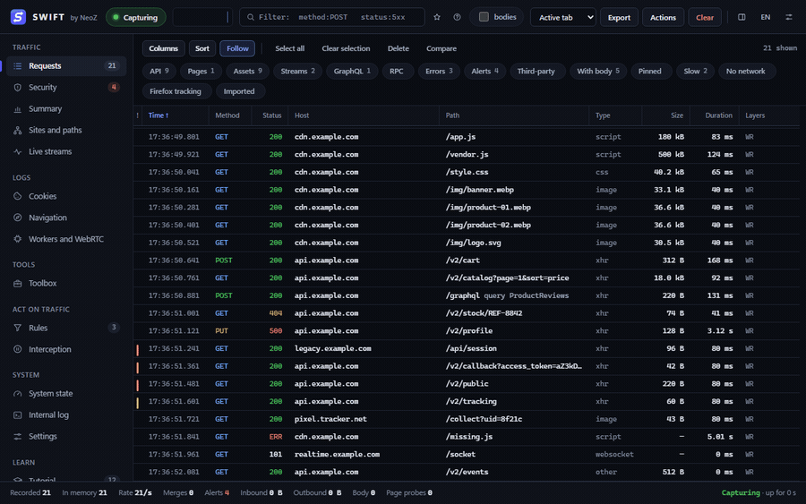

<sub>33 seconds, no narration needed. <a href="docs/demo.mp4">Full-resolution video</a> · every frame is
the running tool, driven the way you would drive it.</sub>

</div>

> Firefox's own network panel shows you *that* a request happened.
> SWIFT shows you **everything about it** — the response body pulled off the wire, the
> JavaScript stack that triggered it, the TLS suite that carried it, the exact reason a
> cookie will be rejected — and lets you block it, rewrite it, or send it again.
>
> Eight capture layers, zero duplicated rows, no telemetry, no dependencies, and an analyser
> that refuses to report anything it cannot prove.

---

## In one look

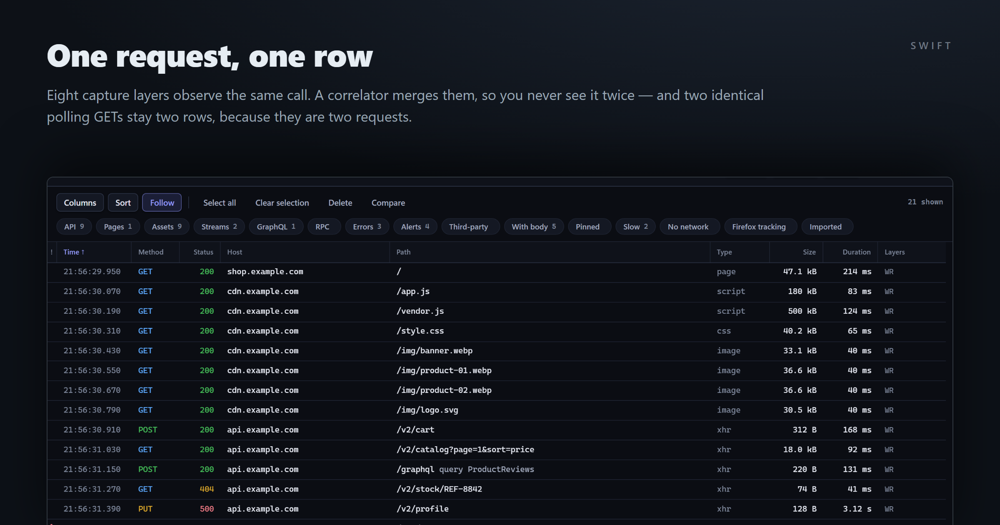

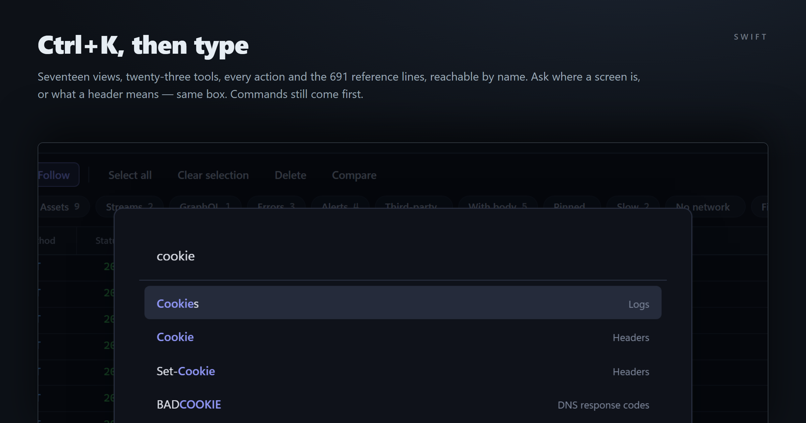

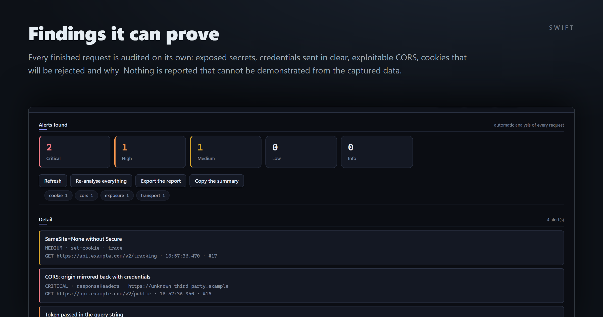

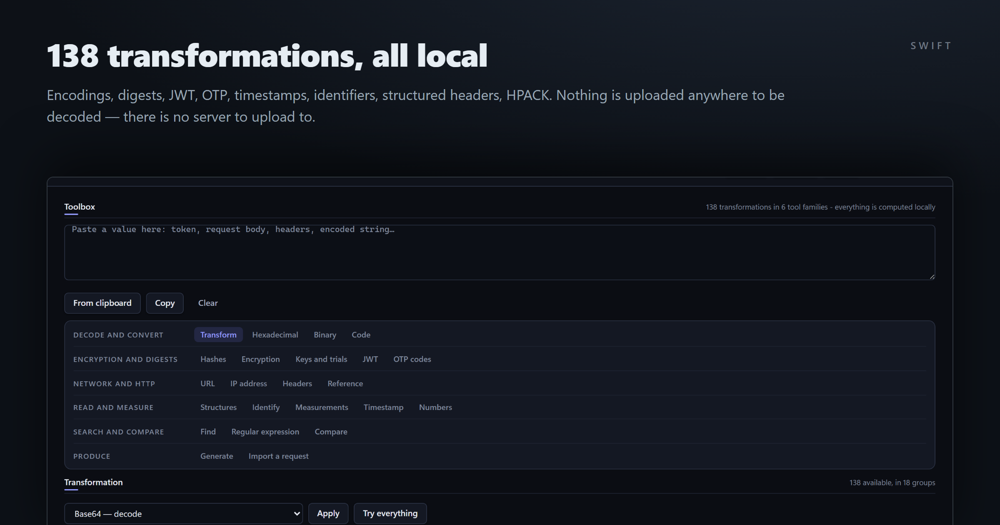

<div align="center">
<sub><b>Every image on this page is a screenshot of the running tool</b>, not a mockup. They are
produced by <code>node tools/captures.mjs</code>, which renders the real console in a headless
browser fed by traffic that went through the <b>real kernel</b> — same store, same analyser,
same statistics as in Firefox.</sub>
</div>

---

## Try it in 60 seconds

No account, no build step, no package to install.

```
1. Download or clone this repository
2. Open  about:debugging#/runtime/this-firefox  in Firefox
3. Click "Load Temporary Add-on…" and pick  manifest.json
```

Capture starts immediately. Browse anything, then press **Ctrl+K** and type `req` to open
the request table. There is nothing to configure — and nothing leaves your machine, because
there is nowhere for it to go.

<sub>The extension disappears when Firefox restarts: that is what temporary loading means.
For something lasting, see [Installation](#3-installation).</sub>

---

## Firefox already has a network panel. Why this?

Because the built-in panel answers *that* a request happened. Most of the time the question
is *why*.

| The question you actually have | The built-in panel | SWIFT |
|---|---|---|
| What did the server send back? | The body, if it is still in the cache | The body **read off the wire as it arrives**, kept even when the cache drops it |
| Which line of my code caused this call? | — | The **JavaScript stack** behind every `fetch`, `XHR`, `sendBeacon` and WebSocket |
| Why is my CORS request blocked? | An error on the wrong row | The `OPTIONS` preflight **paired with the request it authorised**, naming the header that refused |
| Why is this cookie ignored? | The cookie, as sent | The **exact rule it breaks** — prefix, `SameSite`, `Secure`, domain |
| What did that WebSocket frame mean? | `42["order",{…}]` | *socket.io EVENT "order"* — plus **GraphQL**, **JSON-RPC**, **MQTT**, **WAMP**, **STOMP**, **SignalR**, **SockJS**, **Phoenix**, **Action Cable** and **Pusher**, and **never a label without proof** |
| Did my gRPC-Web call succeed? | HTTP 200 | The **`grpc-status` in the trailers**, which is what actually decides |
| What protects this page? | The headers, one by one | **HSTS, CSP, framing, `nosniff`, Referrer-Policy, Permissions-Policy, cross-origin isolation** read together, with what applies when nothing is said |
| What is in this SSO login? | A base64 blob | The **OAuth 2.0 / OpenID Connect** request checked against RFC 9700, or the **SAML** message decoded — issuer, audience, validity, and **what is actually signed** |
| Is this request really signed? | Two opaque headers | The **HTTP message signature (RFC 9421)** rebuilt byte for byte — what it covers and what it leaves out — and **verified** with the key you paste |
| What did this passkey sign-in prove? | A base64 blob | The **WebAuthn** ceremony opened — domain fingerprint recomputed, presence and verification flags, synced key or not — and the sign-in **signature verified** with the public key of the captured registration |
| What did this DNS over HTTPS query ask? | Binary `application/dns-message` | The **question and every answer** decoded, with the EDNS options — client subnet, padding, extended DNS errors |
| Is a secret leaking in this traffic? | — | Every finished request **audited on its own**, with the value masked in the report |
| Can I change a request before it leaves? | — | **Pause it, edit it, release it** — or block, redirect and rewrite by rule |
| Can I share this capture safely? | A HAR carrying every token | A HAR with **secrets masked**, next to the faithful one |
| What is served by a Service Worker? | Nothing — `webRequest` never sees it | Caught by `PerformanceObserver`, on **its own row** |

It is not a replacement for the DevTools panel. It is what you open when the panel has
stopped being enough.

---

## Table of contents

1. [What it is](#1-what-it-is)
2. [Screenshots](#2-screenshots)
3. [Installation](#3-installation)
4. [How it works: the capture layers](#4-how-it-works-the-capture-layers)
5. [One request = one row: the correlator](#5-one-request--one-row-the-correlator)
6. [Surfaces: popup, sidebar, console](#6-surfaces-popup-sidebar-console)
7. [The views, one by one](#7-the-views-one-by-one)
8. [The detail panel: twelve tabs](#8-the-detail-panel-twelve-tabs)
9. [Search: full syntax](#9-search-full-syntax)
10. [The security analyser](#10-the-security-analyser)
11. [The toolbox: 23 tools in 6 families](#11-the-toolbox-23-tools-in-6-families)
12. [Acting on traffic: rules and interception](#12-acting-on-traffic-rules-and-interception)
13. [Replaying a request](#13-replaying-a-request)
14. [Import and export](#14-import-and-export)
15. [Settings](#15-settings)
16. [Keyboard shortcuts](#16-keyboard-shortcuts)
17. [Privacy: what leaves the machine](#17-privacy-what-leaves-the-machine)
18. [Code architecture](#18-code-architecture)
19. [Why the source is in French](#19-why-the-source-is-in-french)
20. [Tests](#20-tests)
21. [Building the package](#21-building-the-package)
22. [Contributing](#22-contributing)
23. [Licence](#23-licence)

---

## 1. What it is

SWIFT is a Firefox extension that observes **everything** the browser sends and
receives, then gives you the means to understand it and act on it.

The browser's built-in network tools show you requests. SWIFT goes further on four
specific points:

| | What SWIFT does |
|---|---|
| **You never hunt for a feature** | `Ctrl+K` opens a command palette over every view, every tool and every action — **and over the 691 reference lines**. Type three letters — `chm` finds *Sites and paths*, `cook` finds *Cookies* — or type `cache-status`, `429`, `PROPFIND` and get the explanation itself. The registry is built from the real tables, so anything added later appears in it without anyone remembering to register it. |
| **It reads what the browser cannot** | A `application/grpc-web+proto` body is a run of length-prefixed frames, and its **real verdict lives in the trailers** — a gRPC-Web call can answer HTTP 200 and still have failed. The detail panel decodes the frames, the protobuf inside them, and the `grpc-status` that actually decides. |
| **It names every API call** | On the wire, every GraphQL request looks the same: `POST /graphql`, status 200. SWIFT reads the document and puts **the operation that runs in its own column** — `query GetUser`, `mutation Save` — searchable with `gql:`. The detail shows the variables, a batch call by call, an Apollo persisted query **with its SHA-256 recomputed**, and the response's real verdict: complete, partial, execution error or request error, each error with its path. A mutation sent with `GET`, which GraphQL over HTTP forbids, is pointed out along with what the server did with it. The document reader is checked against `graphql-core`, the Python port of the reference implementation. **JSON-RPC 2.0 and SOAP** calls get the same treatment: the method or operation next to the path (`rpc:`), results and errors with the meaning of their code, the SOAP fault, and whether the HTTP status agrees with the body — checked against the examples of their specifications. |
| **It reads what the browser reports about itself** | CSP violations, network errors (NEL), deprecated APIs, interventions: browsers send them in `POST`s that nobody reads. SWIFT opens them field by field, and reads the `Reporting-Endpoints`, `Report-To` and `NEL` headers that ask for them — including the endpoints the browser will ignore, and why. |
| **It turns traffic into an API description** | The captured API calls, exported as **OpenAPI 3.1**: operations, path parameters, request and response schemas, status codes, authentication schemes. It describes only what was observed, says so in the document, and copies no captured value into it. Validated with `openapi-spec-validator` and `jsonschema`. |
| **It says what happened, in one sentence** | Every request opens on a verdict: *Succeeded: 200 OK, in 168 ms*, *Refused by the server: 403 Forbidden*, *Blocked by the “Trackers” rule*, *Response 200, but 1 GraphQL error in the body* — with a button to the tab that holds the details. Nothing in it is guessed: each verdict reuses a reading that is proven elsewhere. |
| **It checks what a body claims** | A body announced as JSON that is in fact an HTML error page, an image announced as PNG whose bytes are a JPEG, an RFC 9457 problem whose `status` contradicts the HTTP status: said plainly. For text served without compression, SWIFT compresses the bytes it received and tells you what gzip would have saved — measured, not estimated. A site's `security.txt` is checked against RFC 9116: contacts, expiry, canonical address, signature. |
| **It checks, rather than repeats** | When a server announces `Content-Digest: sha-256=…`, SWIFT **recomputes the digest on the exact bytes it captured and says whether it matches**, showing both values when it does not. The digest covers the compressed stream, and Firefox decodes a compressed response before any extension sees it: so a match proves itself, a mismatch is asserted only for a response that was not compressed, and otherwise the tab says why there is no verdict rather than report a false mismatch. No browser does this. RFC 9530 and the older RFC 3230 form, plus `Content-MD5`. |
| **It says where the time went** | `Server-Timing` next to the duration actually measured: the server claims 100 of the 214 ms, and the other 114 are network, queueing, or time it does not count. |
| **It finds the cause, not the symptom** | When a CORS request fails, the browser shows the error on *that* request — while the cause sits in the `OPTIONS` preflight a few rows above. SWIFT pairs the two and says which header blocked it: a missing `Access-Control-Allow-Methods`, an origin that does not match, or the classic `*` with credentials, which no browser accepts. |
| **It misses nothing** | Eight capture layers run in parallel: `webRequest`, response bodies via `StreamFilter`, TLS via `securityInfo`, DNS resolution, navigation, cookies, page probes (`fetch`, `XHR`, WebSocket, SSE, Beacon, WebRTC, `PerformanceObserver`), and an optional passive proxy. What one layer misses, another sees. |
| **It never counts twice** | A correlator pairs observations coming from different layers. One real request produces **one** row, even when five layers saw it. Two identical polling `GET`s stay two separate rows. |
| **It explains** | 63 status codes, 40 methods, **229 headers — the whole of the IANA permanent registry, checked by a test**, plus the de-facto ones the registry has never taken in (`X-Forwarded-For`, `CF-Ray`, `RateLimit`, `Sec-GPC`) — 70 media types, 83 ports, 31 TLS cipher suites, TLS alerts, QUIC and HTTP/3 errors, DNS record types. All described in the tool, offline. |
| **It never guesses** | The security analyser only reports what is **provable** from what was captured. Every finding carries its evidence. A missing hardening header is not a vulnerability, so it is not reported. |

**What it is not**: not a proxy, not a vulnerability scanner, not an attack tool. Everything
happens inside your Firefox, on your machine.

**By the numbers**: 220 JavaScript modules, ~44,900 lines, zero external dependencies,
2084 automated assertions, English and French interface.

---

## 2. Screenshots

> Every image below is a screenshot of the real tool. They are produced by
> `node tools/captures.mjs`, which renders the actual console in a headless Chromium fed by
> traffic that was run through the **real kernel** — same store, same analyser, same
> statistics as in Firefox. These are not mockups.

### The request table

All traffic, one row per request. Configurable columns, sorting, quick facets, virtualised
scrolling (the table stays fluid at tens of thousands of rows).

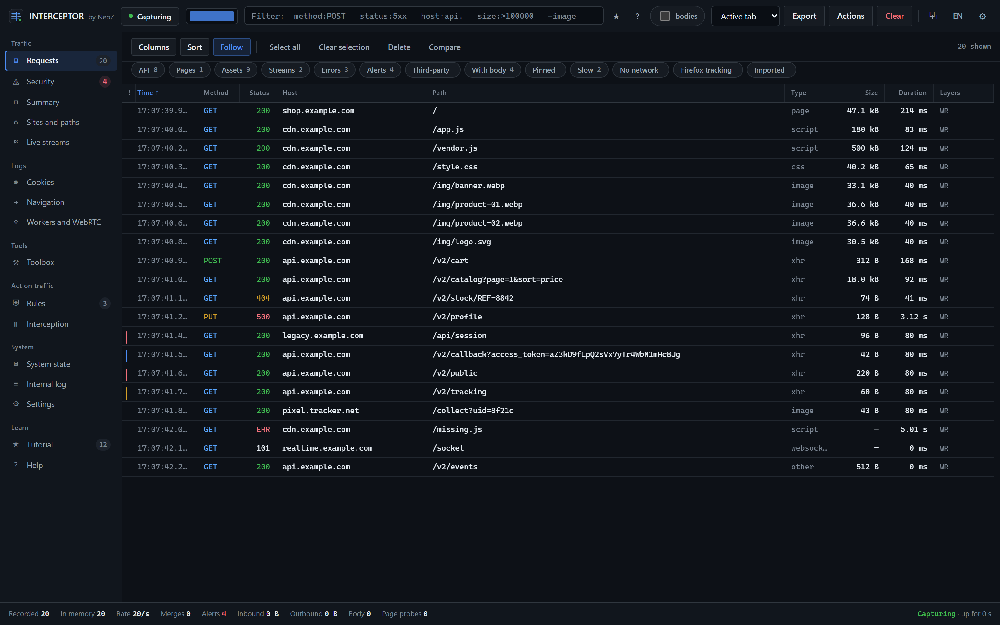

### The command palette

`Ctrl+K` from anywhere. Type a few letters and the matching views, tools and actions rank
themselves; the letters you typed are highlighted so you can see why a result matched. The
list is built from the real view and tool tables, so it never falls out of step with what
the extension can actually do.

**It answers questions too, not just "where is that screen".** The same box searches all
691 reference lines — every header, status code, method, media type, port, TLS cipher
suite, TLS alert, HTTP/2, HTTP/3, QUIC error, DNS record type and DNS response code.
Type `cache-status`, `429` or `PROPFIND` and press Enter: the reference opens on that
exact entry, already explained. No tab to find, no table to pick first.

Commands still come first when both match — `cookies` offers the Cookies view before the
`Cookie` header — so the palette never becomes harder to use as the tables grow.

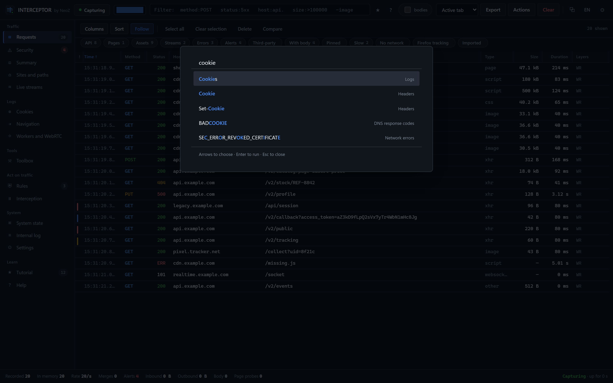

### The Security view

What the analyser was able to **prove**, ranked by severity, each finding carrying its
evidence and a link back to the originating request.

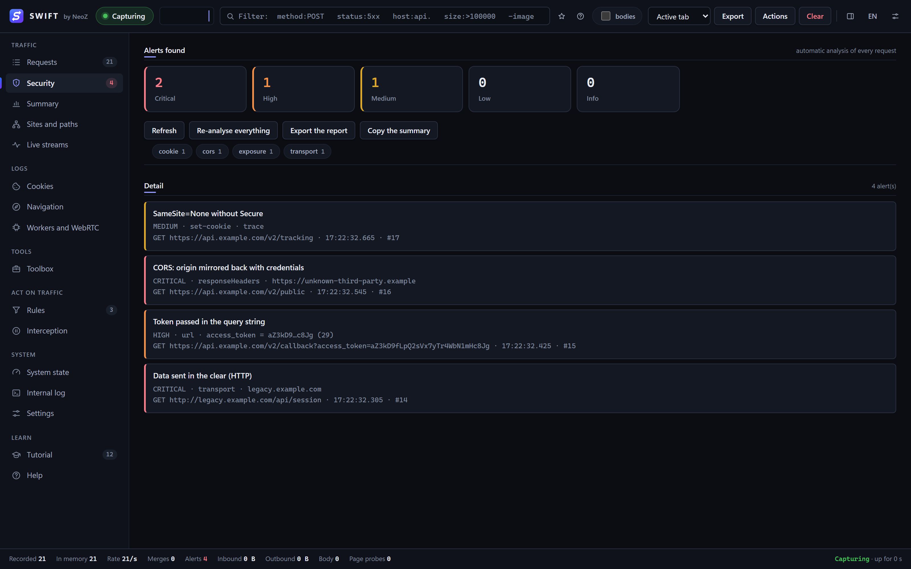

### A request in detail

Twelve tabs covering the whole record, including a "Raw" tab that prints the complete
object: no captured data can escape display.

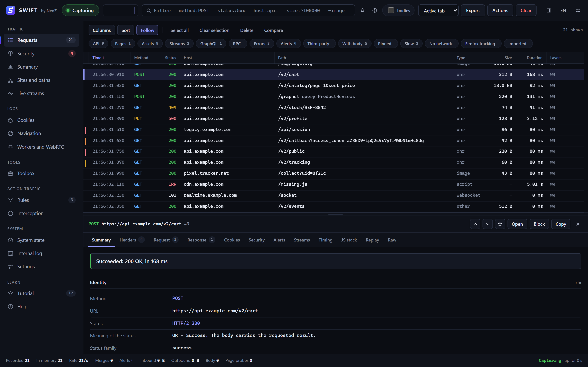

### GraphQL, named and judged

On the network, one more `POST /graphql` with status 200. In the table, the operation that
ran is written next to the path; in the detail, the response says what the status hides: one
error, at `product.reviews`, so the result is partial.

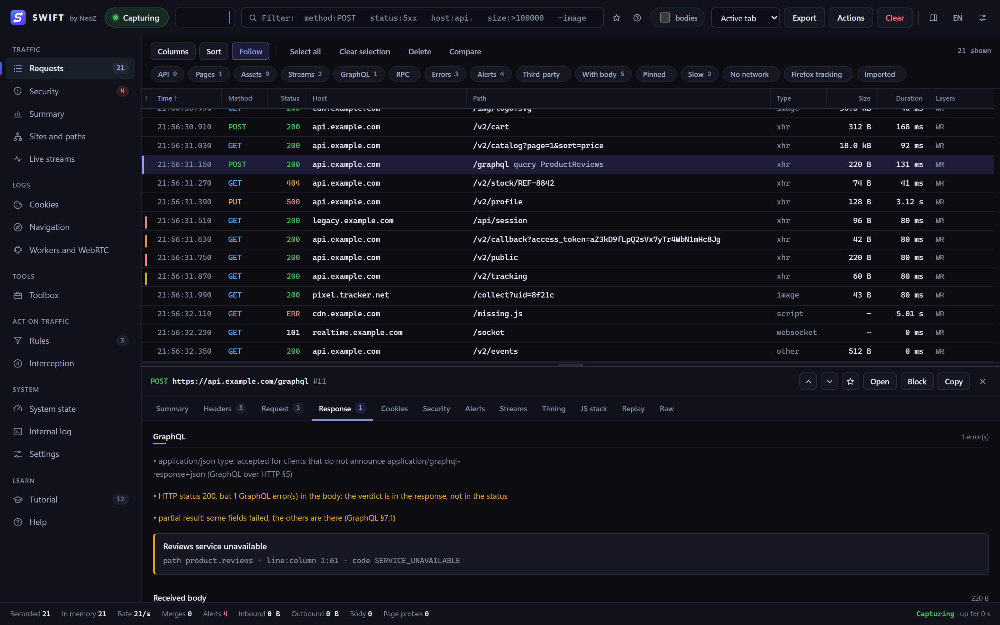

### Headers, read and interpreted

Every header is explained. The **CSP policy** is broken down directive by directive, with a
plain-language statement of what it actually allows. **Cache freshness** is recomputed from
the RFC 9111 formulas, using the headers actually received and the timestamps actually
measured.

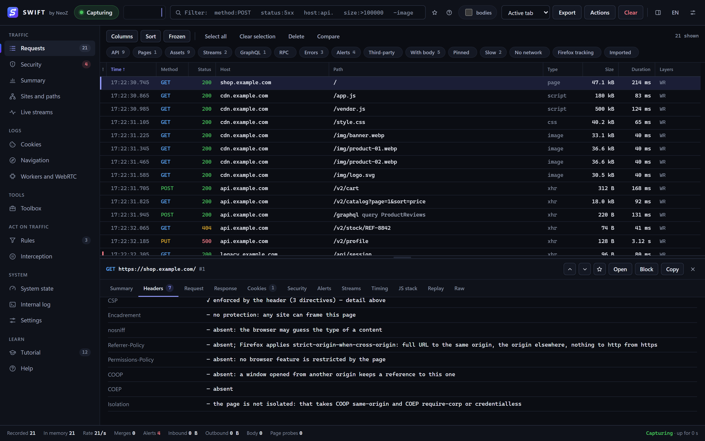

### The numeric summary

The figures for the observed scope: statuses, resource types, domains by volume and by
count, real protocols, active capture layers.

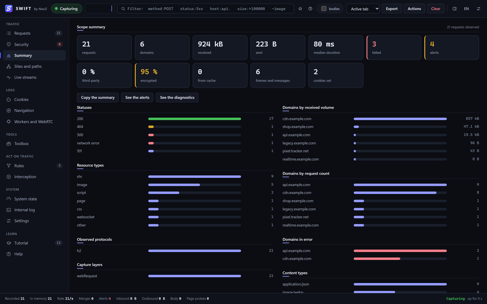

### Sites and paths

What exists on the visited sites, host by host, reconstructed from observed traffic.

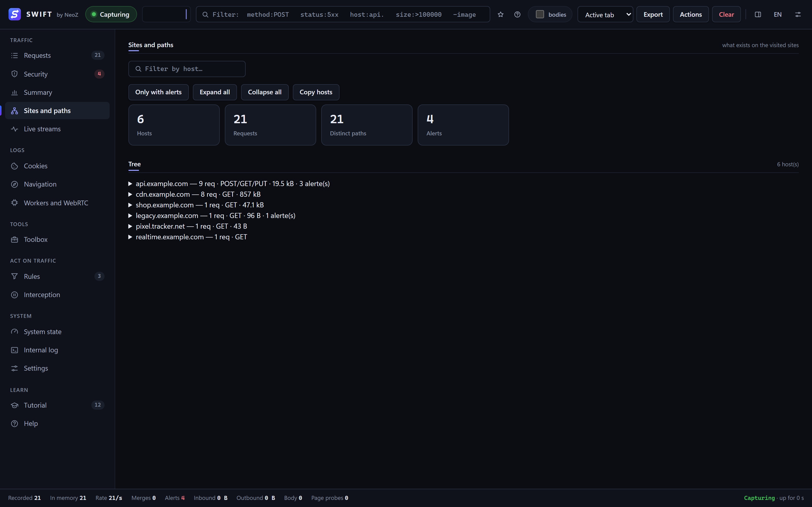

### The toolbox

138 transformations across 23 tools, grouped into six families by intent: decode, hash, measure, inspect — everything is
computed locally, nothing leaves the machine.

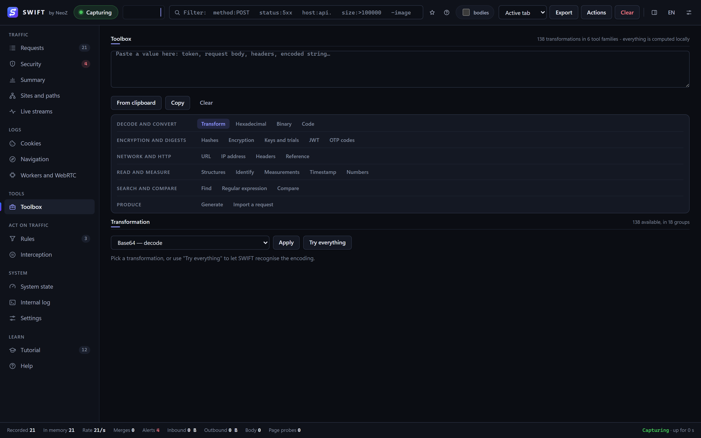

### The reference

Fourteen tables, 691 lines, offline. **All** searches every one of them at once, so you do
not have to know which table answers your question — type `timeout` and get the two status
codes, the header, the HTTP/2 error and the network error together. It searches the
explanations as well as the names: `ocsp` finds the TLS alert that mentions a stapled OCSP
response, which is nowhere in its name.

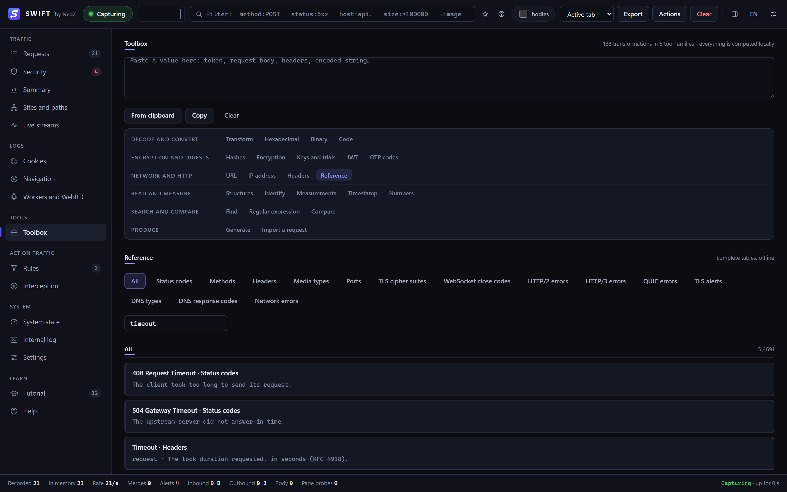

### Rules

Block, redirect, force HTTPS, rewrite headers, mock a response, inject latency, replace a
pattern inside a body.

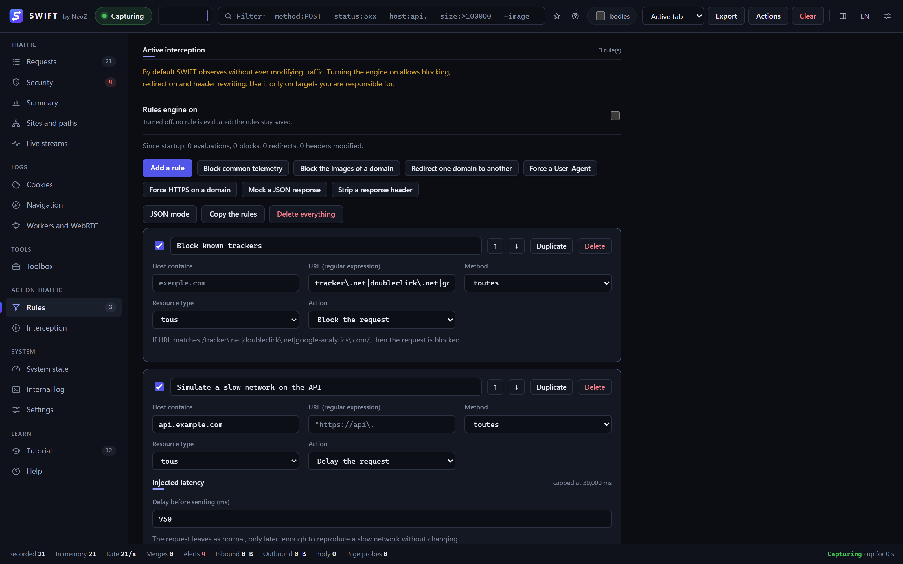

### System state

What each layer is actually capturing, and the kernel's own counters.

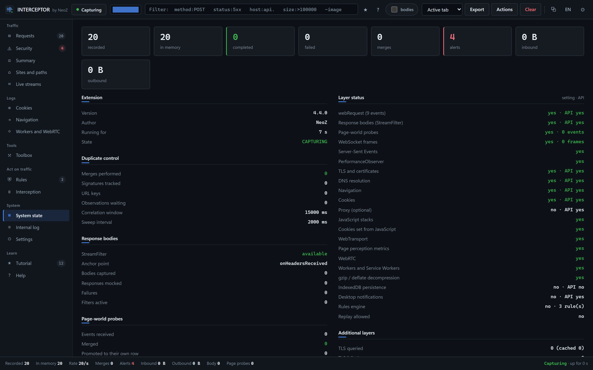

### Settings

Every option, plus four ready-made profiles.

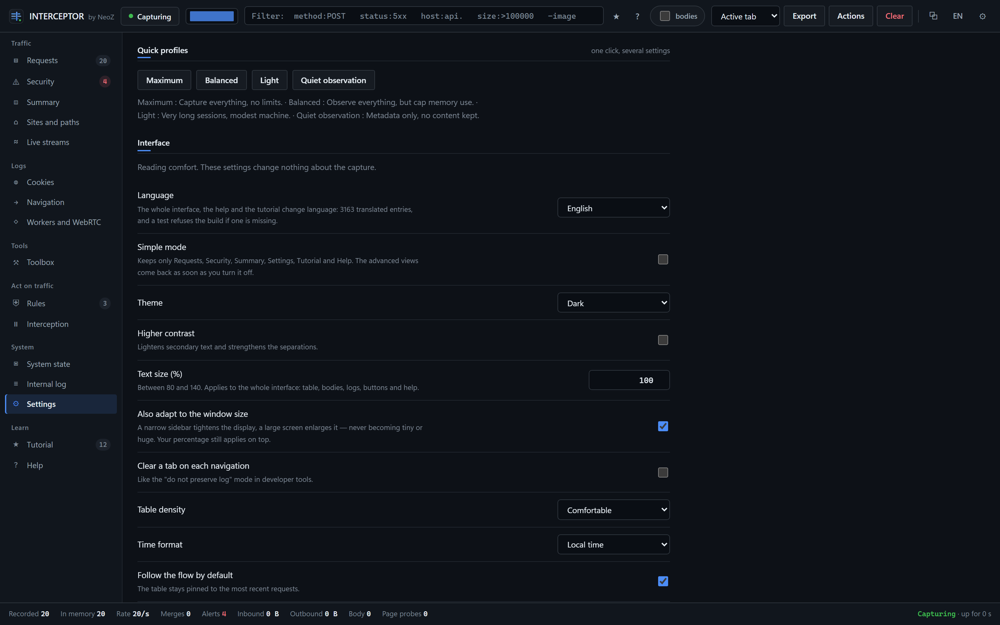

### Built-in help

The complete manual, offline, inside the extension.

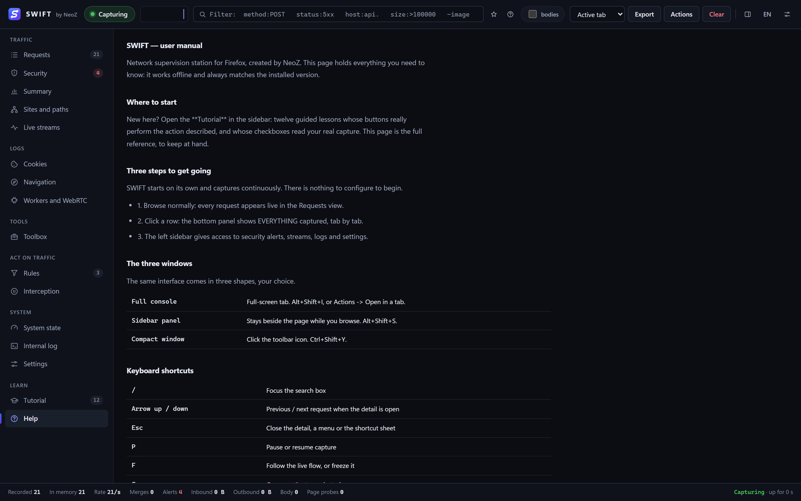

---

## 3. Installation

### A. Temporary load (simplest way to try it)

1. Open `about:debugging#/runtime/this-firefox` in Firefox.
2. Click **Load Temporary Add-on…**.
3. Pick the `manifest.json` file at the root of the repository.

Capture starts immediately, with nothing to configure. The extension disappears when
Firefox restarts — that is how temporary loading works.

### B. `.xpi` package

Download it from the [latest release](https://github.com/isneoz1/interceptor/releases/latest),
or build it yourself:

```powershell
.\build.ps1
```

The package is written to `dist/swift-<version>.xpi`. Firefox only installs an
**unsigned** `.xpi` on **Developer Edition**, **Nightly** or **ESR**, and only after setting
`xpinstall.signatures.required` to `false` in `about:config`. On a standard Firefox, use the
temporary load above.

### C. First run

Nothing to configure. On first start the console opens on the help page. After that:

- **Ctrl+Shift+Y** — the compact window
- **Alt+Shift+S** — the sidebar panel
- **Alt+Shift+I** — the full console in a tab
- **Ctrl+Shift+U** — pause / resume capture, even outside the console

### Permissions requested, and why

| Permission | What it is for |
|---|---|
| `<all_urls>`, `webRequest`, `webRequestBlocking` | Seeing requests and, if you enable it, modifying them |
| `webNavigation` | Knowing which page originated which request |
| `cookies` | Logging every cookie set, changed or removed |
| `dns` | Resolving names to show the address actually contacted |
| `storage`, `unlimitedStorage` | Keeping your settings, and the session if you enable persistence |
| `downloads` | Writing export files to disk |
| `clipboardWrite` | The "Copy" buttons |
| `contextMenus` | The context-menu entries |
| `proxy`, `notifications` | **Optional**: requested only if you turn those features on |

---

## 4. How it works: the capture layers

The kernel (`background/`) starts eight layers in the order of a request's life cycle. Each
one sees something the others cannot.

```
   ┌─ proxy ─────────── earliest hook (optional, passive)
   │
   ├─ webRequest ────── 9 events: onBeforeRequest → onCompleted / onErrorOccurred
   │   ├─ StreamFilter ─ the response body, as it arrives on the wire
   │   ├─ securityInfo ─ certificate, TLS version, cipher suite
   │   └─ dns.resolve ── canonical name and resolved addresses
   │
   ├─ navigation ────── page context: which document, which frame
   │
   ├─ cookies ───────── cookie mutations, including those made from JavaScript
   │
   └─ page probes ───── injected into the page (content/hooks.js):
       fetch, XMLHttpRequest, WebSocket, EventSource (SSE), sendBeacon,
       WebRTC, Service Workers, PerformanceObserver, JS call stacks
```

**Why several layers?** Because none of them is enough on its own:

- `webRequest` does not give you the response body → `StreamFilter` does.
- `webRequest` never sees a request served from cache or by a Service Worker →
  `PerformanceObserver` does.
- `webRequest` cannot tell you *which line of JavaScript* triggered the call → the page
  probe captures the stack.
- Individual WebSocket frames never pass through `webRequest` → the probe reads them.

Each layer can be enabled and disabled independently in the settings, and the **System
state** view shows live what each one is actually capturing.

---

## 5. One request = one row: the correlator

This is the heart of the project, and the hardest problem in it. Three layers can each
report the same request - `webRequest`, the page probes and `PerformanceObserver` - and two
more (`tls`, `proxy`) tag the record afterwards. The result must be a single row.

The correlator (`background/core/dedup.js`) enforces three strict rules:

1. **Two observations from the same layer never merge.**
   Two identical `GET`s issued by a polling loop stay two distinct rows. That is what you
   want to see.

2. **A secondary observation joins a record at most once.**
   Strict 1:1 pairing, FIFO. `webRequest` is the authoritative layer; the others attach to
   it, each exactly once.

3. **An orphan observation becomes its own row.**
   If no parent is found within the correlation window, the observation is promoted to a
   standalone row. **Nothing is ever lost** — a Service Worker request, which appears in no
   `webRequest` event at all, stays visible.

The pairing signature is `METHOD + normalised URL + tab/frame`. URL normalisation
(lowercasing, default port removed, `.` and `..` segments resolved) means
`HTTPS://A.FR:443/x/../y` and `https://a.fr/y` produce the same key.

The **Merges** counter in the status bar shows how many observations were paired. The
**System state** view breaks down layers, promoted orphans and pending queues.

---

## 6. Surfaces: popup, sidebar, console

The **same page** serves as popup, sidebar panel, full-screen tab and options page. The
layout adapts to the available width, and the typographic scale is recomputed so it stays
readable from a 340 px sidebar to a 4,000 px display.

| Surface | How to open | What for |
|---|---|---|
| **Popup** | Click the toolbar icon | A quick glance: counters, pause, jump to the console |
| **Sidebar panel** | `Alt+Shift+S` | Watching while you browse — the page stays visible |
| **Full console** | `Alt+Shift+I` | The complete workstation |
| **Options page** | Add-ons manager | The same console |

What clicking the icon does is configurable in the settings (popup, tab, sidebar or
detached window).

<div align="center">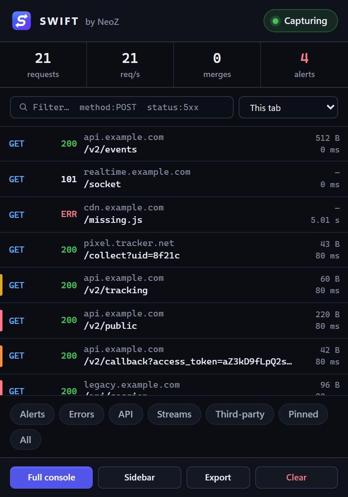</div>

---

## 7. The views, one by one

The sidebar groups 17 views into six families. **Simple mode** (in settings) hides the
advanced views and keeps only the essentials.

### Traffic

| View | What it shows |
|---|---|
| **Requests** | All traffic, request by request. The table is virtualised with an exact-height invariant, so `scrollHeight` never shifts while you scroll and the wheel stays smooth at any zoom level. Configurable columns, sorting on any column, quick facets (API, pages, resources, streams, errors, alerts, third-party, slow…), multiple selection, per-row context menu, free-text annotation and colour marking. The table is virtualised: only visible rows are drawn. |
| **Security** | The analyser's findings, grouped by severity, each with its evidence and a link to the request. Rendered in batches as you scroll, so nothing is capped and nothing freezes. The report can be exported as Markdown. |
| **Summary** | The overall figures: requests, domains, volumes received and sent, median duration, errors, third-party share, encrypted share, cache, frames, cookies. Then the breakdowns: statuses, resource types, domains by volume and by count, real protocols, content types, capture layers. |
| **Sites and paths** | The tree of what exists on each visited host, reconstructed from traffic. Useful to see an application's real surface. |
| **Live streams** | WebSocket and Server-Sent Events, message by message, with direction (in/out), timestamp and payload. **It keeps your place while traffic keeps arriving**, and draws a long session in batches as you scroll, so nothing is left out and nothing freezes. Frames riding a known subprotocol are also read: `42["order",{...}]` is shown as *socket.io EVENT "order"*, alongside the raw frame. Eleven families are decoded, each by its published specification: **Engine.IO / socket.io**, **STOMP**, **SignalR**, **GraphQL over WebSocket** (both `graphql-transport-ws` and Apollo's older `graphql-ws`, with the operation name), **JSON-RPC 2.0** (web3, LSP), **WAMP** (JSON, batched, MessagePack, CBOR), **SockJS** (with the STOMP it usually carries), **Phoenix Channels**, **Action Cable**, **Pusher** and binary **MQTT 3.1.1 / 5**, packet by packet. **A frame gets a label only when something proves it**: its form cannot belong to anything else (`"jsonrpc":"2.0"`), or the connection says so — the subprotocol the server negotiated, or a URL such as `/socket.io/?EIO=4`. A text like `2024` or `3` is not called an Engine.IO ping, and binary bytes are never read as MQTT without the `mqtt` subprotocol. |
| **Comparison** | Two requests side by side, line by line: headers, bodies, timings. Select two rows and press `C`. |

### Logs

| View | What it shows |
|---|---|
| **Cookies** | Every cookie set, changed or removed, with the cause and all its attributes. Like the other logs, rendered in batches: no entry is hidden behind a display cap. |
| **Navigation** | Page and frame changes: start, commit, DOM ready, completion, errors, history changes. |
| **Workers and WebRTC** | Workers, Service Workers, WebRTC connections and page performance metrics. |

### Tools

| View | What it shows |
|---|---|
| **Toolbox** | See [section 11](#11-the-toolbox-23-tools-in-6-families). |

### Acting on traffic

| View | What it shows |
|---|---|
| **Rules** | Automatic interception rules. See [section 12](#12-acting-on-traffic-rules-and-interception). |
| **Interception** | The queue of suspended requests, to edit then release one by one. |

### System

| View | What it shows |
|---|---|
| **System state** | What each layer is actually capturing, the browser capabilities detected, and the counters of the store, the correlator and the analyser. This is the view to check when something seems to be missing. |
| **Internal log** | SWIFT's own errors, and the log of its own commands. Exportable for a bug report. |
| **Settings** | See [section 15](#15-settings). |

### Learning

| View | What it shows |
|---|---|
| **Tutorial** | Twelve lessons to get to grips with the tool. A lesson is only ticked once you have actually performed the action — never on your behalf. |
| **Help** | The complete manual, offline. |

---

## 8. The detail panel: twelve tabs

Click a row and the panel opens at the bottom, resizable. The ↑ ↓ arrows move to the
previous or next request **in displayed order**, filters included.

| Tab | Contents |
|---|---|
| **Summary** | **The verdict in one sentence**, then identity (method, URL, status with its meaning, media type), network (IP, real protocol, cache, on-the-wire sizes, performance metrics), context (tab, window, frame, document, origin, third-party, Firefox tracking classification), **where the request comes from** as Firefox declares it (`Sec-Fetch-Site`, `-Mode`, `-Dest`, `-User`, in plain words), and the free-text annotation. |
| **Headers** | URL parameters, request headers, response headers, headers as seen by page JavaScript. Every known header is explained on hover. Then two computed analyses: **HTTP freshness** (RFC 9111: freshness lifetime, current age broken down, time remaining, validators, `Vary`, directives) and the **CSP policy** (each directive with its meaning, then a plain statement of what the policy allows). Then the **response protections** — HSTS (and whether Firefox already enforces it for the host), CSP, framing, `nosniff`, the effective Referrer-Policy, Permissions-Policy, COOP / COEP / CORP and cross-origin isolation, and what the server says about itself — as facts, never as alerts. For a page, **a CSP derived from what it actually loaded**, ready to try in Report-Only, with what the network cannot show stated plainly. An **HTTP message signature** (`Signature-Input` / `Signature`, RFC 9421) is rebuilt: the components it covers, its parameters, and **the exact signature base**, byte for byte, from what Firefox reported — then verified with a key you paste (RSA-PSS, RSA PKCS #1, ECDSA P-256 and P-384, Ed25519, HMAC). What cannot be rebuilt — a trailer, a header Firefox did not report — is named instead of producing a false "invalid". Last, **report collection**: the `Reporting-Endpoints`, `Report-To` and `NEL` headers — where reports go, which endpoints the browser will ignore (a value that is not a string, an origin that is not secure), and the NEL sampling fractions. A **`Clear-Site-Data`** header is read: what the browser will erase. |
| **Request** | The body sent: nature, source, declared type, encoding, compression. Automatic JSON formatting, form fields broken out, and **`multipart/form-data` bodies decoded part by part** (field name, filename, type, content). An **OAuth 2.0 / OpenID Connect** authorization or token request is read — flow, PKCE, `state`, `nonce`, redirect URI — and checked against RFC 6749, RFC 7636 and RFC 9700, without ever reproducing a secret. A **SAML** message is decoded in both bindings: issuer, subject, audience, validity at capture time, and **which element is signed** — the response, the assertion, or nothing. A **passkey registration or sign-in (WebAuthn)** is opened: the signed origin and challenge, the domain fingerprint (`rpIdHash`, recomputed to name the domain), the presence and verification flags, whether the key is synced, the signature counter, the authenticator model (AAGUID) and its public key. A sign-in signature is **verified automatically** with the public key of the registration when that registration was captured. A **DNS over HTTPS** query (`?dns=` or `application/dns-message`) is decoded. A **GraphQL** request is read in all four forms — URL parameters, JSON body, batch, file-upload multipart form: the operation that runs (chosen the way GraphQL's GetOperation chooses it), the variables, and an Apollo **persisted query whose SHA-256 is recomputed** against the text sent with it. A **browser report** (`application/reports+json`, `application/csp-report`) is opened report by report: CSP violation, network error with the meaning of its NEL type, deprecation, intervention, Permissions-Policy. **JSON-RPC 2.0** calls (method, id or notification, parameters, a batch call by call) and **SOAP 1.1 / 1.2** envelopes (operation and its namespace, `SOAPAction` or the `action` parameter, header blocks) are read too. |
| **Response** | The body received, with the same treatment, plus image preview and hex rendering for binary. An OAuth token response is summarised. For a script or stylesheet, the **Subresource Integrity hashes** (SHA-256, -384, -512) and a ready `integrity` tag — computed at capture time on the exact bytes the page received, and refused only when the body was truncated. **WebAuthn options** sent by a server are read (challenge length, accepted algorithms, user verification, resident key, attestation). A **DNS over HTTPS** answer is decoded record by record — A, AAAA, CNAME, MX, TXT, SOA, SRV, CAA, HTTPS / SVCB, DS, DNSKEY, RRSIG — with the EDNS options. A **GraphQL** response is judged: complete result, partial result, execution error or request error (GraphQL §7.1), each error with its path and code, an HTTP 200 that hides errors, the status rules of `application/graphql-response+json`, and the schema an introspection query handed out. **JSON-RPC** results and errors with the meaning of each standard code, a request left without a response, a notification that got one; the **SOAP fault** (code, subcode, reason, detail) and the SOAP 1.1 rule that a fault is served with HTTP 500. An **RFC 9457 problem** (`application/problem+json`): type, title, detail, extension members, and a `status` member that contradicts the status served. **Body checks**: content that contradicts its declared type, and for text served without compression, the gzip size **measured** on the bytes received. A **`security.txt`** file is checked against RFC 9116. A script or stylesheet that announces a **source map** (ECMA-426: `SourceMap` header or `sourceMappingURL` comment) shows its address. |
| **Cookies** | Cookies set and changed by this request, with all attributes detailed. |
| **Security** | TLS version, cipher suite, key exchange, forward secrecy, ECH, HSTS — and **every certificate of the chain read in full from its DER bytes**, like Firefox's certificate viewer: the names it covers (DNS, IP, email, URI), key algorithm and size, key usages, whether it is a certificate authority, the validation level it declares (DV, OV, IV or EV), where to check revocation (OCSP, CRL), the issuer's certificate, key identifiers, and the embedded Certificate Transparency proofs with their log and timestamp. One click copies the PEM or opens it in the toolbox. |
| **Alerts** | The analyser's findings for this request, each with its evidence. |
| **Streams** | The WebSocket frames, SSE messages, WebRTC data-channel messages or WebTransport datagrams of this connection. **A session that is still receiving grows as you watch it** — frames are appended, never redrawn, and only while you are at the bottom of the panel, so reading further up is never interrupted. **A binary frame keeps its bytes**: the format is named when protobuf, MessagePack or CBOR recognises it, the opening bytes are shown in hex, and a click sends the frame to the toolbox. |
| **Timeline** | The network phases the browser actually measured — blocked, DNS, TCP connection, TLS, waiting for the first byte, receiving — as disjoint bars, so their sum is right. **Nothing is filled in**: the browser does not expose when sending ends, so no "sending" figure is invented; and when it hides the detail of a resource from another origin (no `Timing-Allow-Origin`), the tab says so instead of showing 0 ms and 0 bytes. Then every step, timestamped, from first observation to last. |
| **JS stack** | The JavaScript call stack that triggered the request, when the page probe was able to capture it. |
| **Replay** | See [section 13](#13-replaying-a-request). |
| **Raw** | The complete object as it exists in memory. This is the safety net: **no captured data can stay invisible**. An automated test (`tests/detail-coverage.test.mjs`) verifies that each of a record's 60 fields is displayed somewhere. |

---

## 9. Search: full syntax

The search box accepts free text, regular expressions between `/`, and per-field filters.
Terms combine with **AND**. A leading `-` **excludes**.

```
method:POST status:5xx host:api. size:>100000 -image /regex/
```

### Text fields

`method:` `type:` `host:` `path:` `url:` `gql:` `rpc:` `mime:` `scheme:` `proto:` `ip:` `tag:` `risk:`
`src:` `state:` `init:` `tls:` `error:` `classe:` `note:` `color:`

### Numeric fields

Accept `>`, `<`, `>=`, `<=`, `=` and ranges.

`status:` (also accepts `2xx` through `5xx`) `size:` `duration:` `tab:` `frame:` `id:`
`findings:` `redirects:` `ws:` `sse:` `cookies:` `wire:`

### Boolean fields

`flag:` (pinned) `third:` (third-party) `cache:` (served from cache) `body:` (body captured)
`stack:` (JS stack present) `private:` (private browsing) `replayed:` (replayed)
`imported:` (came from an imported HAR)

### Firefox Network Monitor criteria

The filters you already use in Firefox's own network panel work here unchanged:

`has-response-header:` and `has-request-header:` (a header with exactly that name),
`set-cookie-name:` `set-cookie-domain:` `set-cookie-value:` (cookies set by the response),
`larger-than:` (size in bytes), `is:running` `is:cached` `is:from-cache`, `regexp:` (on the URL).
Firefox's names for criteria that already exist are accepted as synonyms: `status-code:`
`domain:` `remote-ip:` `mime-type:` `protocol:` `transferred:`.

### Examples

| Query | What it finds |
|---|---|
| `status:5xx` | Every server error |
| `host:api. method:POST` | POSTs to a host containing "api." |
| `size:>1000000` | Everything over one megabyte |
| `duration:>3000 -image` | Slow requests, images excluded |
| `risk:critical` | Requests carrying a critical finding |
| `third:true cookies:>0` | Third parties that set cookies |
| `/\/api\/v[0-9]+\//` | Versioned API paths, by regular expression |
| `tag:cleartext` | Everything travelling in the clear |
| `-has-response-header:content-security-policy type:main_frame` | Pages served without a `Content-Security-Policy` header |
| `set-cookie-domain:.example.com` | Responses that set a cookie whose domain contains `.example.com` |
| `gql:mutation` | Every GraphQL mutation, whatever URL it was sent to |
| `gql:GetUser` | The GraphQL operation named `GetUser` |
| `tag:graphql-introspection` | GraphQL servers that handed their schema to an introspection query |
| `tag:rapport-navigateur` | Reports the browser sent on its own (CSP, NEL, deprecations) |
| `rpc:eth_call` | JSON-RPC calls to `eth_call` |
| `rpc:SOAP` | Every SOAP call |
| `tag:security-txt` | `security.txt` files the browser loaded |
| `tag:source-map` | Scripts and stylesheets that announce a source map |

The **bodies** checkbox extends the search to bodies, headers, frames and stacks.
The ★ button saves the current filter and recalls recent searches.
The `?` button next to the field opens the full syntax help.

---

## 10. The security analyser

One governing rule: **a finding is only reported if it is provable from what was captured,
and if it corresponds to a genuinely exploitable weakness.** Every finding carries its
evidence, in plain language.

### What is reported

| Rule | Severity | Evidence |
|---|---|---|
| Credentials written in the URL | critical | The URL contains `user:password@` — the password is in history, in logs and in the `Referer` |
| Token passed in the query string | high | An unambiguously named parameter (`access_token`, `api_key`…) carries a value long enough to be a token |
| Unsigned JWT (`alg: none`) | critical | The token's own header says so: its payload can be altered without a key |
| Data sent in the clear (HTTP) | critical | `http` scheme **and** something worth stealing: `Authorization`, a cookie, or a request body |
| Mixed content on an HTTPS page | high | The page is `https`, the resource is `http`: modifiable in transit |
| Untrusted certificate / domain mismatch | critical | Firefox rejects the certification chain |
| Expired certificate, obsolete TLS, broken cipher suite | high | Version or suite read from `securityInfo` |
| CORS: origin mirrored with credentials | critical | The server echoes the client's `Origin` **and** sets `Allow-Credentials: true` |
| CORS: `null` origin with credentials | high | Same mechanism, with the `null` origin |
| Cookie set in the clear | high | Set by an `http` response without `Secure`: it will travel back in the clear |
| `__Host-` / `__Secure-` prefix not honoured | medium | The prefix's requirements are not met: **the browser rejects the cookie** |
| `SameSite=None` without `Secure` | medium | The combination is refused by the browser |
| Secrets in bodies and headers | varies | A value matching a known provider's exact format, which cannot be confused with anything else |
| CSP nonce reused | medium | The same `nonce-…` appears in the CSP of two distinct responses: a nonce only protects if it is unpredictable, and an injected script can reuse this one. Cached responses and `304`s are not counted |

### Facts, not alerts

Some observations are exactly true without being a vulnerability by themselves. They are shown in
the Alerts tab with their evidence, tagged in the table, and **never counted as alerts**:

- **A parameter comes back in the response** — the value of a query or form parameter appears
  verbatim in the body, and whether its special characters came back unescaped (tags `reflete`
  and `reflete-brut`). It is where anyone testing an injection starts; nothing says in which
  context the value lands, so nothing more is claimed.
- **A redirect leads exactly to a parameter's value** — the shape of an open redirect (tag
  `redirection-parametree`); it does not prove the server would accept any value.

### What was deliberately removed, and why

- **"Missing security headers"** — absent hardening is not a vulnerability, it is a missed
  opportunity. Nothing is exploitable purely because a header is not there.
- **"Personal data"** matched by regular expression (email, card, IBAN) — too many false
  leads, and finding an address in a page is not a vulnerability.

That is why a clean capture shows **zero findings** instead of a wall of noise.

### Related settings

Secret masking is on by default: a detected value is displayed truncated. You can add your
own secret and tracker patterns in the settings.

---

## 11. The toolbox: 23 tools in 6 families

138 transformations, 23 tools grouped into six families by what you are trying to do — decode and convert, encryption and digests, network and HTTP, read and measure, search and compare, produce — **all computed locally**. A row's context menu, and the
"Toolbox" buttons in the detail panel, send a value straight into it.

| Family | Contents |
|---|---|
| **Transform** | The full catalogue of 138 transformations, grouped: bases, text, web, casing, Unicode normalisation, lines… — and **JSON to JSON Schema 2020-12**, from one document or several examples in JSON Lines: a property is required only when present in every example, a format is claimed only when every value matches it, and no value is copied into the schema |
| **Keys and trials** | XOR (including single-byte key search), Vigenère, Caesar across all 26 shifts |
| **Encryption** | AES-GCM / CBC / CTR, PBKDF2 derivation, RSA and ECDSA signing and verification |
| **JWT** | Header and payload decoding, labels for standard claims, signature verification with a key, **JWK thumbprint (RFC 7638)** |
| **Digests** | MD5, SHA-1, SHA-2, SHA-3, Keccak, SHAKE, BLAKE2b/2s, RIPEMD-160, SM3, MD4, NTLM, CRC (20 standard variants), Adler-32, FNV-1a, MurmurHash3, xxHash32, **xxHash64**, **SipHash-2-4**, HMAC |
| **Measures** | Length, bytes, Shannon entropy, character distribution |
| **Hexadecimal** | Hex dump with ASCII column |
| **Binary** | Protocol Buffers, MessagePack, CBOR, ASN.1/DER and X.509 certificates, character sets and mojibake repair, **WebSocket and HTTP/2 frames decoded byte by byte, including full HPACK header decompression** (RFC 7541: static table, dynamic table, Huffman) |
| **Code** | Call-code generation in 39 formats (see [section 14](#14-import-and-export)), readability and deobfuscation |
| **OTP codes** | HOTP and TOTP (RFC 4226 / 6238), neighbouring windows, `otpauth://` links |
| **Identify** | Recognising an unknown value: format, likely encoding, candidate digest. **Identifiers are decoded, not just recognised**: a UUID gives its version, variant and — for v1, v6 and v7 — the timestamp it embeds; ULID, Snowflake (Twitter, Discord, Instagram), MongoDB ObjectId and KSUID give their creation date, machine, sequence and counter |
| **Timestamps** | Fourteen origins read side by side: Unix in seconds / milliseconds / microseconds / nanoseconds, Windows FILETIME, Chrome/WebKit, HFS, Apple/Cocoa, .NET ticks, Excel serial, Julian day, **NTP** (RFC 5905), **GPS**, plus the **packed MS-DOS date** used in ZIP archives. ISO week and durations |
| **Numbers** | Conversion between bases 2 to 36, boundary values, Luhn |
| **Structures** | JSON, XML, YAML: navigable tree, JSONPath paths, CSS and XPath selectors. **PHP `serialize()`** is read as a tree — arrays, objects, enums, references, and the NUL-encoded `protected`/`private` visibility — and never executed |
| **Headers** | A pasted header block is split line by line, each value broken down, each point worth a look flagged. `Content-Disposition` filenames are decoded through **RFC 8187** extended values, **RFC 2231** continuations and **RFC 2047** encoded-words, so the real filename is shown rather than `UTF-8''%e2%82%ac%20rates`. Modern headers written as **RFC 9651 structured fields** (`Priority`, `Accept-CH`, `Cache-Status`, `Content-Digest`, `Signature-Input`) are parsed into their real types across all **eight** base types: `42` is an integer, `"42"` is a string, `:YQ==:` is a byte sequence, `@1659578233` is a date, and `%"h%c3%a9"` a display string |
| **Search** | Ready-made patterns: tokens, keys, addresses, identifiers |
| **Regular expression** | Test bench with capture groups and replacement |
| **Compare** | Line-by-line and word-by-word diff, Levenshtein distance, similarity |
| **URL** | Every part of the URL, RFC 3986 canonical form, known service on the port, **homograph detection** (a Cyrillic "а" inside a Latin word is flagged) |
| **IP address** | IPv4 and IPv6: mask, network, broadcast, usable range, category, subnetting, summarising a prefix list, range to prefixes, enumeration, reverse names `in-addr.arpa` / `ip6.arpa` (read both ways) |
| **Reference** | The complete tables, offline, with an **All** search across the fourteen of them at once: 63 statuses, 40 methods, **229 headers (the entire IANA permanent registry)**, 70 media types, 83 ports, 31 TLS cipher suites, WebSocket close codes, HTTP/2 errors, **HTTP/3 and QPACK errors**, **QUIC transport errors**, **TLS alerts**, **DNS record types**, **DNS response codes**, Firefox network errors |
| **Generate** | UUID v3/v4/v5/v7, ULID, nanoid, passwords with strength calculation, MAC addresses, random hex and base64 |
| **Import a request** | Paste a `curl` command and turn it back into a replayable request |

---

## 12. Acting on traffic: rules and interception

> **Off by default.** Until you enable something, SWIFT observes without ever altering
> traffic.

### Rules

A rule has **conditions** and an **action**.

**Conditions**: host (contains), URL (regular expression, with capture groups), method,
resource type. They combine with AND.

**Actions**:

| Action | Effect |
|---|---|
| `block` | The request is cancelled |
| `redirect` | The request goes to another URL — `$1`…`$9` expand the capture groups |
| `upgrade` | An `http` request is reissued as `https` |
| `modifyHeaders` | Adds, replaces or removes request and response headers |
| `mock` | The page receives a simulated response — **the server's real body is still recorded** |
| `delay` | The request leaves with a delay, to simulate a slow network (capped at 30 s) |
| `replaceBody` | The page receives the server's body with a pattern replaced |

Seven ready-made templates ship with the tool (block known trackers, simulate an API
outage, force HTTPS, inject a header…). Every rule states in plain language what it does:
*"If host contains 'example.com' AND method is POST, then the request is blocked."*

A rule whose URL expression is unparseable is **inert** and flagged as such: a forgotten
parenthesis must never turn "this URL" into "every URL".

### Manual interception

Suspends a request before it leaves, long enough to edit it by hand and then release it. The
queue is visible in the **Interception** view. If every console is closed, everything is
released automatically: no navigation can stay blocked with nobody left to decide.

---

## 13. Replaying a request

The **Replay** tab of the detail panel takes a captured request, lets you change anything
(method, URL, headers, body) and sends it again. The response appears alongside, and the
replayed row is marked in the table (`replayed:true`).

Useful for: checking that a parameter changes the result, testing a boundary value,
reproducing an error, comparing two variants with the **Comparison** view.

---

## 14. Import and export

### Exporting the capture

| Format | File | What for |
|---|---|---|
| **HAR 1.2** | `.har` | The standard interchange format: readable by Firefox, Chrome, Charles, Fiddler, Wireshark… |
| **HAR 1.2, secrets masked** | `.har` | The same file, made shareable. `Authorization`, `Cookie`, `Set-Cookie` and the other secret-bearing headers lose their value; so do query parameters whose name announces a secret, and anything the analyser's own patterns recognise, wherever it sits — including inside a response body. The file says how many values it masked, so a sanitised export is never mistaken for traffic that had nothing to hide. The faithful export stays next to it: you need that one to replay. |
| **Full JSON** | `.json` | Every record in full, with the statistics |
| **CSV** | `.csv` | For a spreadsheet |
| **Postman collection** | `.postman_collection.json` | Replaying in Postman |
| **OpenAPI 3.1** | `.openapi.json` | The API calls described for Swagger UI, Redoc, Postman or a client generator: operations, path parameters (only segments shaped like identifiers), request and response schemas, statuses, Bearer and Basic authentication. One origin per document — the toast says which, and how many calls to other origins were left out. It holds what crossed the network and nothing else: query parameters are never marked required, and no captured value is copied into it. |
| **Findings report** | `.md` | The security summary in Markdown |
| **URL list** | `.txt` | One URL per line |
| **Settings** | `.json` | Configuration backup |
| **Diagnostics** | `.json` | The internal log, for a bug report |

### Generating call code

A captured request can be reproduced in **39 formats**:

- **Command line** — cURL (bash, PowerShell, cmd.exe), wget, HTTPie,
  PowerShell `Invoke-WebRequest` and `Invoke-RestMethod`
- **JavaScript and Python** — `fetch`, Node.js, Python `requests`, Python `http.client`
- **Ruby** — `net/http`, HTTParty
- **PHP** — cURL, Guzzle
- **Go, Rust** — `net/http`, `reqwest`
- **JVM** — Java `java.net.http`, OkHttp, Kotlin
- **.NET** — C# `HttpClient`, RestSharp
- **Apple** — Swift `URLSession`, Objective-C `NSURLSession`
- **Others** — Dart, Elixir, R, Perl, Clojure…
- **Raw and documentation** — raw HTTP request, raw HTTP response, Markdown sheet, full
  JSON record

A multiple selection exports a complete, ready-to-run script.

### Importing

- **HAR** — a HAR file produced by another tool loads into the table; imported rows are
  marked `imported:true`.
- **Session** — a SWIFT capture exported as JSON reloads in full.
- **curl** — a pasted `curl` command becomes a replayable request.
- **Settings** — an exported configuration can be re-imported.

---

## 15. Settings

Project rule: **every option present has a real effect in the code, and every option in the
interface exists in the configuration. No decorative settings.**

### Four ready-made profiles

| Profile | What it does |
|---|---|
| **Full** | Every layer, every body, no limits |
| **Light** | Captures the essentials, caps bodies — for long sessions |
| **Discreet** | No bodies, no stacks — minimal memory footprint |
| **Security** | Everything that feeds the analyser, the rest reduced |

### The settings groups

- **Appearance and language** — French / English, dark / light / automatic theme, high
  contrast, text scale (with automatic screen adaptation), density, time format, simple mode
- **Capture layers** — 16 independent switches, from the webRequest layer down
  to WebTransport and page vitals
- **Bodies** — request and response body capture, byte caps, binary bodies, resource types
  to skip
- **Streams** — WebSocket frames (text and binary), SSE messages, WebRTC data channels, WebTransport datagrams, caps
- **Analysis** — analyser on/off, secrets, transport, cookies, CORS, secret masking, custom
  secret and tracker patterns
- **Interface** — auto-scroll, default scope, body wrapping, JSON formatting, icon click
  behaviour, console position
- **Badge and notifications** — what the toolbar badge shows, desktop notification on a
  critical finding
- **Persistence** — keep the capture across restarts, storage cap
- **Cleanup** — clear on navigation, cap on rows held in memory

---

## 16. Keyboard shortcuts

| Key | Effect |
|---|---|
| `Ctrl+K` | Open the command palette — every view, tool and action by name, and every reference entry by its protocol name |
| `/` | Focus the search box |
| `↑` `↓` | Previous / next request |
| `Esc` | Close the detail panel, a menu, or this window |
| `P` | Pause or resume capture |
| `F` | Follow the stream or freeze it |
| `C` | Compare the two selected rows |
| `S` | Save the current filter |
| `1` to `9` | Switch to a view |
| `?` | Show the keyboard help |
| `Ctrl+click` | Add a row to the selection |
| `Shift+click` | Select a range of rows |
| `Right click` | Row context menu |
| `Ctrl+Shift+Y` | Open the compact window |
| `Alt+Shift+S` | Open the sidebar panel |
| `Alt+Shift+I` | Open the console in a tab |
| `Ctrl+Shift+U` | Pause / resume, even outside the console |

---

## 17. Privacy: what leaves the machine

**Nothing.**

- The extension issues no network request of its own, except the ones **you** explicitly
  trigger: a replay, a manual probe.
- No telemetry, no account, no server.
- Every reference table is bundled: the toolbox and the help work **offline**.
- All computation (digests, encryption, decoding) happens in the browser.
- The capture lives in memory. It is only written to disk if you enable persistence, and
  then only into the extension's own local storage.
- Exports are written where you ask for them, by Firefox's download manager.

The content security policy declared in the manifest forbids any external script:
`script-src 'self'; object-src 'none'; child-src 'none'; frame-src 'none'`.

---

## 18. Code architecture

No external dependencies, no build step. These are ES modules loaded directly by Firefox.

```
manifest.json              Manifest V2, Firefox 115+

background/                The kernel — persistent background page
├── background.js          Startup, badge, menus, shortcuts
├── core/
│   ├── config.js          Configuration: defaults, persistence, broadcast
│   ├── store.js           In-memory record store (60 fields per row)
│   ├── dedup.js           Anti-duplicate correlator
│   ├── analyzer.js        Analysis orchestration
│   ├── analyzer-regles.js The security rules and their evidence
│   ├── secrets.js         Secret and tracker patterns
│   ├── persist.js         Session kept across restarts
│   └── debug.js           Internal log
├── capture/               The eight layers
│   ├── webrequest.js      9 webRequest events
│   ├── streamfilter.js    Response bodies on the wire
│   ├── bodies.js          Body decoding and decompression
│   ├── security.js        TLS and certificates
│   ├── dnsinfo.js         DNS resolution
│   ├── navigation.js      Page context
│   ├── cookies.js         Cookie mutations
│   ├── proxy.js           Proxy layer (optional)
│   └── probe.js           Manual probe
├── ingest/                Non-webRequest inputs
│   ├── page.js            Observations from the page probes
│   ├── promote.js         Promotion of orphan observations
│   ├── har.js             HAR import
│   └── curl.js            curl command parsing
├── rules/
│   ├── engine.js          Rule engine
│   └── intercept.js       Manual interception
├── export/                HAR, JSON, CSV, Postman, OpenAPI 3.1, report, 39 code generators
├── api/                   Command service for the UI, live broadcast
└── lib/                   Shared kernel utilities

content/
├── bridge.js              Page ↔ kernel bridge (content script)
└── hooks.js               Probes injected into the page

ui/                        The interface — one page for all four surfaces
├── console.html/.js       Shell: header, navigation, view routing
├── app.js                 Shared state, kernel access, theme, scale
├── popup.html/.js         The popup
├── theme.css, console.css Visual foundation (everything keys off --scale)
├── console/               One view per file, plus the detail panel
└── lib/                   Codecs, digests, network, reference tables, i18n

tests/                     2084 assertions, no browser required
tools/sockets.mjs          Real WebSockets against a real server: page, worker, WebRTC
tools/transparence.mjs     What a page can tell about the probes — it should be nothing
tools/minutage.mjs         Network timing phases in a real browser: only real measurements
tools/interaction.mjs      Types into every filter and reads through redraws, in a real browser
tools/defilement.mjs       Scrolls 20 000 rows in a real browser, looking for holes
tools/affichage.mjs        Opens every view at four widths, looking for overflow
tools/captures.mjs         Generates the documentation screenshots
tools/banniere.mjs         Generates the social preview card (docs/images)
tools/vitrine.mjs          Composes the showcase images at the top of this file
tools/demo.mjs             Films the demonstration (docs/demo.mp4 and demo.gif)
tools/scene.mjs            Real traffic through the real kernel, shared by the above
tools/chrome.mjs           Headless Chromium over the DevTools protocol
tools/apercu-icone.mjs     Renders the icon at the sizes Firefox actually uses
tools/apercu-theme.mjs     Renders the console in a given theme, a row open, to judge it by eye
tools/verifier-openapi.mjs Builds OpenAPI documents and schemas for tools/verifier-openapi.py,
                           which checks them with openapi-spec-validator and jsonschema
build.ps1                  Verification and .xpi packaging
```

### Principles held throughout the code

- **Every captured field is displayed.** A test enforces it mechanically.
- **No decorative settings.** Every option has a real effect.
- **No unprovable finding.** Each one carries its evidence.
- **Nothing is ever lost.** An observation without a parent becomes its own row.
- **Short, cohesive files.** 200 to 400 lines typically.
- **Every colour pair is measured.** Both themes are verified against WCAG 2.1 contrast
  thresholds by a test; the build stops if any text falls below the reading threshold. A
  dark interface is easy to make pretty and unreadable.
- **Nothing is capped for display.** Long lists render in batches rather than being truncated.
- **Comments explain *why*,** not *what*.

---

## 19. Why the source is in French

The source comments and internal identifiers are in French, and that is deliberate rather
than an oversight.

The interface is fully bilingual, but the translation layer works by using **the French text
itself as the lookup key**:

```js
t('Requetes')   // → "Requests" in English mode, "Requetes" otherwise
```

`ui/lib/dict-en*.js` maps French source strings to English. A string missing from the
dictionary simply displays its French original — never an empty label, never a raw key. That
design has a real benefit (the UI can never show a broken placeholder) and one consequence:
**translating the source strings would break English mode entirely.**

Error messages go through `te()`, which also recognises messages that carry a value —
`caractere invalide dans le base32 : 9` becomes *invalid character in the base32: 9* —
through templates with holes (`ui/lib/dict-en-erreurs.js`). The test suite refuses a
displayed text written straight into the page, a sentence built by concatenation, and an
error message without a translation or a template.

So the source stays French. Everything a reader or user meets — this README, the repository
description, the releases — is in English, and the extension itself runs in English or
French at the flip of a setting.

---

## 20. Tests

```bash
npm test
```

2084 assertions, with no browser and no dependencies. The kernel and interface modules are
written for Firefox; `tests/harnais.mjs` supplies the minimum WebExtension API and DOM they
need to import and run under Node. **The logic under test is exactly the logic that runs in
the browser, with no rewriting.**

| Suite | Assertions | What it covers |
|---|---|---|
| `core.test.mjs` | 232 | URL normalisation, correlation signatures, the store, the rule engine (both ways: what matches **and** what must not), the security analyser rule by rule, HAR export, curl import, all 39 code generators |
| `avance.test.mjs` | 469 | WebSocket and HTTP/2 frames, CSP, RFC 9111 freshness, multipart, canonical URLs and homographs, protocol tables, binary structures, rare digests, generators |
| `ui-load.test.mjs` | 281 | Actual loading of the 174 interface modules, complete module graph (no dead import, no file outside the graph), consistency with the HTML pages and the manifest, **full translation coverage** — every displayed string must have a dictionary entry, including labels that reach the translator through a table (`allRows` labels, search help, CSP directive meanings), **no text written straight into the page or built by concatenation**, which no dictionary entry can match, and **every text of the HTML pages** — labels, tooltips, screen-reader names, placeholders — translated and set again by the script — and **measured contrast**: every colour pair in both themes is checked against the WCAG 2.1 thresholds |
| `detail-coverage.test.mjs` | 130 | Each of a record's 60 fields is displayed, each tab has a render function, each searchable field exists |
| `outils.test.mjs` | 108 | The toolbox, against published vectors |
| `rendu.test.mjs` | 85 | The interface **actually rendered**: sixteen views against three captures, the eleven detail tabs, the twenty-two toolbox panels against thirty-two hostile inputs, and 264 deliberately malformed HAR files — then a fragment-by-fragment comparison of both languages, so nothing can stay in French on an English screen. It also counts the commands each view sends the kernel: **a view that re-renders itself in a loop is caught in a second instead of freezing the tab**. Finally the translator itself reports every text it could not translate while everything is rendered in English: a French sentence that arrives through a variable can no longer hide |
| `lectures.test.mjs` | 166 | What 4.4 reads, checked against its sources: the HAR timing rules (TLS inside `connect`, counted once), every WebSocket subprotocol **and every text that must receive no label**, MQTT packet by packet, the certificate reader **cross-checked against the OpenSSL X.509 parser built into Node**, and the Firefox search criteria |
| `securite.test.mjs` | 141 | The security tools against independent references — gzip and DEFLATE made by `node:zlib`, digests by `node:crypto`: the analyser's facts and the reused-nonce alert, digests judged only on what the captured bytes can prove, hostile SAML input and DEFLATE bombs, every response protection, the derived CSP, OAuth 2.0 against RFC 9700, and SAML in both bindings, down to **which element is signed** |
| `decodeurs.test.mjs` | 209 | What 4.6 reads, against independent references: every example of **RFC 9421** (Appendix B and section 2) — signature bases **identical byte for byte**, RSA-PSS, ECDSA, HMAC and Ed25519 signatures verified with the published keys, a tampered base refused — and every case where a base cannot be rebuilt; the strict **RFC 9651** serialisation; **WebAuthn** registrations and sign-ins made by Yubico's `fido2` in ES256, EdDSA and RS256, signatures verified and a tampered one refused; **DNS** messages made by `dnspython` and the RFC 8484 example, with hostile inputs (pointer loops, oversized names, truncation) |
| `protocoles.test.mjs` | 263 | What 5.0, 5.1 and 5.2 read, against independent references: **GraphQL** documents — the operations, the one that runs and introspection — compared with `graphql-core`, the Python port of the reference implementation, on 27 documents chosen for their traps; the Apollo persisted-query hash against the example Apollo publishes; the four transport forms, batches and the facts about responses; **browser reports** with the field names of the W3C and WICG specifications and the 30 NEL error types; report collection and the endpoints the browser ignores; **JSON Schema** inference and the **OpenAPI 3.1** export — whose output is also checked with `openapi-spec-validator` and `jsonschema` by `tools/verifier-openapi.mjs`; **JSON-RPC 2.0** against every exchange of its specification (§7) copied as is; **SOAP 1.1 and 1.2** against the examples of the SOAP 1.1 Note and the SOAP 1.2 Primer; the **RFC 9457** example; **`security.txt`** against the RFC 9116 example; and the **measured compression**, whose gzip is decompressed back to the identical text by `node:zlib`; the **verdict** in every case and its order of precedence, **Fetch Metadata**, **Clear-Site-Data** and **source maps** against their specifications |

Expected values come from published sources: RFC vectors (4226, 6238, 6455, 4231, 7541, 9113,
3986, 7578, 9111, 8187, 2231, 2047, 6266, 7638, 8941, 9421, 9651, 8484, and ZeroMQ RFC 32),
independent libraries (Yubico `fido2` for WebAuthn, `dnspython` for DNS, `graphql-core` for
GraphQL, `openapi-spec-validator` and `jsonschema` for the OpenAPI export, `node:crypto` and
`node:zlib`), standard check values (all 20 CRC variants are verified against their
published check value for `123456789`), FIPS 202 for SHA-3, RFC 7693 for BLAKE2, RFC 9562
for UUIDs.

---

## 21. Building the package

```powershell
.\build.ps1 -Verify    # verify without building
.\build.ps1            # verify, test, then write dist/swift-<version>.xpi
```

The script checks that the 161 required files are present and that every surface declared in
the manifest exists on disk, then runs the nine test suites. **If a test fails, the build
stops.**

Works with Windows PowerShell 5.1 as well as PowerShell 7.

To regenerate the documentation screenshots:

```bash
node tools/captures.mjs
```

### Audits that need a real browser

The nine test suites run under Node with no browser, which is what lets them run everywhere.
Two things cannot be checked that way, because they only exist once a layout engine is
involved — so they live as tools, and each prints a verdict and an exit code:

```bash
node tools/defilement.mjs            # 20 000 rows, scrolled for real
node tools/affichage.mjs             # every view at 350, 700, 1100 and 1600 px
node tools/sockets.mjs               # every kind of socket, against a real server
node tools/transparence.mjs          # what a page can tell about the probes
node tools/minutage.mjs              # network timing: only what the browser measured
node tools/interaction.mjs           # typing into every filter, reading through redraws
```

**`defilement.mjs`** fills the store with 20 000 requests, then scrolls the table down and
back up a thousand steps. At each step it checks that the drawn rows follow one another
with no gap and no repeated index, that they cover the visible area from top to bottom,
that `scrollHeight` does not move between frames — it is what makes a scrollbar jump — and
that the batch-rendered lists keep posting until nothing is left. It then opens the detail
panel, which is the heaviest surface in the console, on a 20 000-frame WebSocket session
and a 5 MB response body, and measures both.

**`affichage.mjs`** opens every view at four widths, including the 350 px of a Firefox
sidebar, and looks for a page that overflows horizontally, an element wider than its frame
with nothing able to scroll it into view, two siblings that overlap when they should stack,
and text cut off with nothing to say so.

**`transparence.mjs`** is the one that guards the promise at the top of
`content/hooks.js`: the probes are *purely passive*. A page that notices `fetch` has been
replaced is no longer being observed — it is being **changed**, and plenty of sites check
exactly that and behave differently when they find it. The tool has a page measure itself,
installs the probes, has it measure itself again, and compares 42 observations: the name,
length and prototype of every replaced function, `instanceof` and prototype chains,
`Function.prototype.toString` — the `[native code]` check — property descriptors, the type
of error thrown by malformed calls, and subclassing. Anything that differs is a finding.

**`sockets.mjs`** starts a real WebSocket server — RFC 6455 handshake and framing, fifty
lines, no dependency — then opens real connections from a page, from a `Worker`, from a
`SharedWorker`, and a WebRTC data channel between two peer connections. It checks that every
connection, every text frame, every **binary frame with its bytes**, the negotiated
sub-protocol and the close code are captured — and that the page is not disturbed: its
worker still receives its own messages, and a relative `importScripts` inside that worker
still resolves.

**`minutage.mjs`** loads, in a real browser, a same-origin resource served after a known
delay and two resources from **another origin** — one without `Timing-Allow-Origin`, one
with it — and checks what the real probe reports. The wait must reflect the server's delay,
no "sending" time may be invented, the phases must not add up to more than the request
lasted, and a resource whose detail the browser hid must be reported as hidden — not as
0 ms of DNS, 0 bytes, and a "reception" equal to the absolute clock, which is what the
previous probe reported (1219 ms for a 25-byte file).

**`interaction.mjs`** checks two gestures that only a real browser and a real keyboard can
catch. It types into every filter field of the console, **one key at a time**, and checks
that the field kept the focus and everything typed — seven of them used to keep only the
first letter, or lose the focus after a pause, because the view rebuilt the field it was
typing into. Then it scrolls 6,000 px into a 3,000-frame WebSocket session and through a
fully expanded site tree, makes the view redraw the way live traffic does, and checks the
reader is still exactly where they were — they used to be sent back to the top several
times a second.

---

## 22. Contributing

Bug reports and suggestions are welcome.

For a useful bug report: open the **Internal log** view, export the diagnostics, and attach
the file. It contains internal errors and the command log — not your traffic.

Before opening a pull request:

```bash
npm test              # all 2084 assertions must pass
.\build.ps1 -Verify   # the build must be green
```

Repository conventions: dependency-free ES modules, files of 200 to 400 lines, French
comments that explain the *why* (see [section 19](#19-why-the-source-is-in-french)), and one
non-negotiable rule — **no feature that claims something it cannot prove.**

[CONTRIBUTING.md](CONTRIBUTING.md) has the practical detail: what the build checks beyond the
tests, how to add a decoder, and why a string assembled at runtime can never be translated.
[CODE_OF_CONDUCT.md](CODE_OF_CONDUCT.md) covers the rest.

---

## 23. Licence

[MIT](LICENSE) — © 2026 NeoZ

---

<div align="center">

**SWIFT** · created by NeoZ

*See everything. Invent nothing.*

</div>
